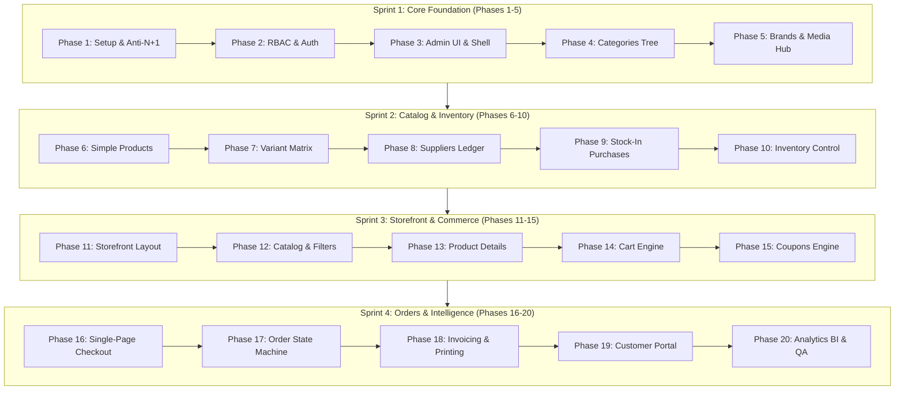

# 🌟 ORIO E-COMMERCE: MASTER ARCHITECTURE & 20-PHASE CONVERSATION BLUEPRINT
> **PERMANENT SYSTEM CONTEXT & DEVELOPER GUIDE FOR ALL CHAT CONVERSATIONS**  
> *Any AI agent or developer starting a new chat session for any feature must read this file first.*

---

## 📌 1. PROJECT IDENTITY & STACK SPECIFICATION

* **Project Name:** Enterprise Single-Vendor E-Commerce Platform (`ORIO ECOMMERCE`)
* **Author & Lead Architect:** Jahidul Islam (`jahidcse181@gmail.com`)
* **Backend Architecture:** Laravel 11.x/12.x (PHP 8.3+) with Regular MVC + Action/Service Domain Layer
* **Frontend Architecture:** React.js 18+ (Inertia.js v2 Monolithic SPA bridge)
* **Styling Engine:** Tailwind CSS 3.4+ (Utility-first, responsive, dark/light mode ready)
* **Database & Cache:** MySQL 8.0 (InnoDB, strict types, compound indexes) + Redis (Sessions, Caches, Queues)
* **PDF & Printing Engine:** DomPDF / Browsershot (A4 Tax Invoices) + `@media print` CSS (80mm POS Thermal Receipts)
* **Analytics Engine:** ApexCharts / Chart.js for real-time sales curves, gross profit margins, and MoM/YoY growth rates

---

## 🛡️ 2. NON-NEGOTIABLE ARCHITECTURAL & PERFORMANCE RULES

Every code modification in any phase/conversation **must adhere to these 6 rules**:

1. **Anti-N+1 Query Policy:**
   - Strict lazy loading is forbidden in development: `Model::preventLazyLoading(!app()->isProduction())`.
   - Every Eloquent query retrieving relationships must explicitly use eager loading: `with(['relation:id,name'])` or `loadMissing()`.
2. **Action / Service Layer Separation (No Fat Controllers):**
   - Controllers only handle HTTP requests, invoke FormRequest validation, call an Action/Service, and return an Inertia response.
   - All complex business logic (Order placement, stock updates, invoice generation, profit calculations) lives in `app/Actions/` or `app/Services/`.
3. **Atomic Database Transactions:**
   - Any operation touching multiple tables (Stock-In, Checkout, Order Cancellation, Restock) must be wrapped in `DB::transaction(function() { ... }, 5)`.
4. **Real Cost-of-Goods-Sold (COGS) Profit Tracking:**
   - Every order line item must snapshot the product's unit cost price at purchase time so that Gross Profit is mathematically immutable:
     $$\text{Gross Profit} = (\text{Order Subtotal} - \text{Discount}) - \sum(\text{Unit Cost Price} \times \text{Quantity})$$
5. **Zero Hardcoded Content Policy (100% Dynamic Content Engine):**
   - **NO hardcoded strings, logos, phones, emails, social links, currency symbols, or banners are allowed anywhere in the frontend or backend.**
   - All brand identity assets (Site Name, Main Logo, White Logo, Favicon, Tagline, Copyright), Contact Info (Phone, WhatsApp, Support Email, Physical Address, Map URL), Commerce Configs (Currency Symbol, Currency Code, VAT %, Shipping Rates, Free Shipping Threshold), Social Media Links, Homepage Hero Sliders, Promo Banners, and Policy Pages (About Us, Terms, Privacy, FAQ) must be **100% editable from the Admin Settings & CMS Panels**.
   - Settings must be cached in Redis with high performance and shared globally via `HandleInertiaRequests.php` (`$page.props.settings`) so every React component has instantaneous zero-query access.
6. **Standardized Directory Structure:**
   ```
   app/
   ├── Actions/          # Single-purpose domain mutations (CreateOrderAction, AdjustStockAction)
   ├── Services/         # Reusable engines (CartSessionManager, InvoicePdfGenerator, CouponService, SettingService)
   ├── Http/
   │   ├── Controllers/  # Thin Inertia handlers (Admin/, Storefront/, Auth/)
   │   ├── Middleware/   # EnsureAdminAccess, HandleInertiaRequests (Shared Settings)
   │   └── Requests/     # Form validation (ProductStoreRequest, CheckoutRequest, SettingUpdateRequest)
   ├── Models/           # Eloquent models with typed scopes and relations
   resources/
   ├── js/
   │   ├── Components/   # Common, Admin, and Storefront atomic components
   │   ├── Layouts/      # AdminLayout.jsx, StoreLayout.jsx, AuthLayout.jsx
   │   └── Pages/        # Inertia views (Admin/*, Store/*, Customer/*)
   ```

---

## 🗺️ 3. THE 20 PHASES DIRECTORY (CONVERSATION PICK-UP GUIDE)

Whenever a new conversation is created, specify which Phase you are working on. The agent will execute following this roadmap:



---

### 🔹 PHASE 1: PROJECT SETUP, INERTIA BRIDGE & ANTI-N+1 RULES
* **Scope:** Laravel 11/12 setup, Inertia React, Tailwind CSS 3.4+, Redis connection, and strict Eloquent anti-N+1 configuration in `AppServiceProvider.php`.
* **Key Files:** `app/Providers/AppServiceProvider.php`, `tailwind.config.js`, `vite.config.js`, `resources/views/app.blade.php`, `resources/js/app.jsx`.
* **Testing:** Run `php artisan migrate` and trigger lazy load query $\to$ verify `LazyLoadingViolationException` throws.

---

### 🔹 PHASE 2: ROLE-BASED ACCESS CONTROL (RBAC) & AUTHENTICATION
* **Scope:** `users` table with `role` enum (`super_admin`, `admin`, `manager`, `inventory_staff`, `customer`), Auth controllers, and `EnsureAdminAccess` middleware.
* **Key Files:** `database/migrations/create_users_table.php`, `app/Http/Controllers/Auth/AuthController.php`, `app/Http/Middleware/EnsureAdminAccess.php`.
* **Testing:** Customer login $\to$ store; Admin login $\to$ `/admin/dashboard`; Customer accessing `/admin/*` $\to$ `403 Forbidden`.

---

### 🔹 PHASE 3: ADMIN DASHBOARD SHELL & UI COMPONENT SYSTEM
* **Scope:** Responsive Admin layout (collapsible desktop sidebar, mobile drawer, topbar) and reusable UI component kit (`Button`, `Modal`, `DataTable`, `Badge`, `ToastContainer`).
* **Key Files:** `resources/js/Layouts/AdminLayout.jsx`, `resources/js/Components/Common/*`.
* **Testing:** Mobile responsive menu toggle test; Flash message toast pop-up test.

---

### 🔹 PHASE 4: CATEGORY TAXONOMY & SELF-REFERENCING TREE
* **Scope:** Self-referencing parent-child categories migration (`parent_id`), live slug auto-generation, category tree builder UI in React.
* **Key Files:** `database/migrations/create_categories_table.php`, `app/Models/Category.php`, `app/Http/Controllers/Admin/CategoryController.php`, `resources/js/Pages/Admin/Categories/*`.
* **Testing:** Create parent and subcategories $\to$ verify nested tree renders with correct parent FK.

---

### 🔹 PHASE 5: BRAND CATALOG & WEBP MEDIA HUB
* **Scope:** Brand CRUD + `MediaUploadService` (dimension validation, EXIF removal, resizing, automated WebP conversion).
* **Key Files:** `database/migrations/create_brands_table.php`, `app/Services/Media/MediaUploadService.php`, `resources/js/Pages/Admin/Brands/*`.
* **Testing:** Upload 3MB JPEG $\to$ stored as `<150KB` `.webp` in public storage.

---

### 🔹 PHASE 6: CORE PRODUCT CATALOG (SIMPLE / SINGLE PRODUCTS)
* **Scope:** Simple non-variant product schema, pricing, cost price, stock alerts, rich text description, validation requests.
* **Key Files:** `database/migrations/create_products_table.php`, `app/Models/Product.php`, `app/Http/Requests/ProductStoreRequest.php`, `resources/js/Pages/Admin/Products/Create.jsx`.
* **Testing:** Create single product $\to$ verify record in `products` with `has_variants = 0`.

---

### 🔹 PHASE 7: PRODUCT ATTRIBUTE MATRIX & VARIANT SKU BUILDER
* **Scope:** `product_variants` & `product_images` schema, React Cartesian product permutation algorithm (Color $\times$ Size $= N$ SKUs), atomic save service.
* **Key Files:** `database/migrations/create_product_variants_table.php`, `resources/js/Components/Admin/VariantMatrixBuilder.jsx`, `app/Actions/Products/StoreProductAction.php`.
* **Testing:** Add 2 colors $\times$ 3 sizes $\to$ auto-generates 6 variant rows with editable SKU, cost, selling price, and stock.

---

### 🔹 PHASE 8: SUPPLIER DIRECTORY & ACCOUNTS PAYABLE LEDGER
* **Scope:** Supplier profiles, contact information, purchase history, and payable due balance ledger.
* **Key Files:** `database/migrations/create_suppliers_table.php`, `app/Models/Supplier.php`, `resources/js/Pages/Admin/Suppliers/*`.
* **Testing:** Create supplier $\to$ verify row created with `$0.00` initial due balance.

---

### 🔹 PHASE 9: STOCK-IN PURCHASE ORDERS (INVENTORY HYDRATION)
* **Scope:** `purchases` & `purchase_items` schema, `ReceivePurchaseOrderAction` (atomic stock increment, COGS update, supplier due balance update, stock movement log).
* **Key Files:** `database/migrations/create_purchases_table.php`, `app/Actions/Purchases/ReceivePurchaseOrderAction.php`, `resources/js/Pages/Admin/Purchases/*`.
* **Testing:** Purchase 50 units @ $10 $\to$ product stock increases by 50, supplier balance updates.

---

### 🔹 PHASE 10: INVENTORY CONTROL, DAMAGE LOGS & LOW-STOCK ALERTS
* **Scope:** `stock_movements` immutable audit table, manual stock count adjustments, damage write-offs (`damage_out`), low-stock alert badges in topbar.
* **Key Files:** `database/migrations/create_stock_movements_table.php`, `app/Actions/Inventory/AdjustStockAction.php`, `resources/js/Pages/Admin/Inventory/*`.
* **Testing:** Write off 2 damaged units $\to$ live stock drops by 2, logged in audit table.

---

### 🔹 PHASE 11: STOREFRONT MASTER LAYOUT & HOMEPAGE
* **Scope:** Responsive storefront layout (header, live search, mega-menu, mobile navigation bar, footer), Homepage hero slider, category grid, deal carousels.
* **Key Files:** `resources/js/Layouts/StoreLayout.jsx`, `resources/js/Pages/Store/Home.jsx`, `resources/js/Components/Storefront/*`.
* **Testing:** Verify mobile and desktop responsiveness and banner navigation.

---

### 🔹 PHASE 12: CATALOG DISCOVERY, LIVE SEARCH & MULTI-FACET FILTERING
* **Scope:** Shop page with sidebar filters (Categories, Brands, Price slider, In-stock only) synced with URL parameters; debounced live search dropdown.
* **Key Files:** `resources/js/Pages/Store/Shop.jsx`, `app/Http/Controllers/Store/ShopController.php`, `resources/js/Components/Storefront/LiveSearch.jsx`.
* **Testing:** Adjust price filter $\to$ URL updates and product list filters without page reload.

---

### 🔹 PHASE 13: PRODUCT DETAIL PAGE & DYNAMIC VARIANT SELECTOR
* **Scope:** Product detail layout with high-res gallery zoom modal, reactive variant selector (Color/Size swatches dynamically updating live price, SKU, stock), urgency indicators.
* **Key Files:** `resources/js/Pages/Store/ProductDetails.jsx`, `resources/js/Components/Storefront/VariantSelector.jsx`.
* **Testing:** Click variant swatch $\to$ price & SKU switch dynamically; out-of-stock combination disables Add-to-Cart.

---

### 🔹 PHASE 14: CART ENGINE, REDIS SESSIONS & MINI-CART DRAWER
* **Scope:** `CartSessionManager` (guest Redis cart + automatic database merge upon login), slide-out mini-cart drawer with live subtotal calculation and quantity (+/-) controls.
* **Key Files:** `app/Services/Cart/CartSessionManager.php`, `resources/js/Components/Storefront/MiniCartDrawer.jsx`.
* **Testing:** Add item $\to$ mini-cart slides open showing item and subtotal; persists across page transitions.

---

### 🔹 PHASE 15: DISCOUNT COUPON ENGINE & PROMO RULES
* **Scope:** `coupons` schema, `CouponValidationService` (expiry, minimum spend, maximum discount caps, usage limits per customer), instant discount widget in checkout.
* **Key Files:** `database/migrations/create_coupons_table.php`, `app/Services/Discounts/CouponValidationService.php`.
* **Testing:** Apply 20% coupon $\to$ validates spend threshold and applies accurate discount deduction.

---

### 🔹 PHASE 16: SINGLE-PAGE CHECKOUT & PAYMENT METHOD SELECTOR
* **Scope:** Single-page conversion checkout (Contact, Shipping address, Delivery notes, COD / Bank selector), backend rate limiting (`throttle:10,1`).
* **Key Files:** `resources/js/Pages/Store/Checkout.jsx`, `app/Http/Requests/CheckoutRequest.php`, `app/Http/Controllers/Store/CheckoutController.php`.
* **Testing:** Fill form as guest $\to$ validates inputs and submits order.

---

### 🔹 PHASE 17: ORDER PROCESSING & LIFECYCLE STATE MACHINE
* **Scope:** `orders`, `order_items`, `order_status_histories` schema; `CreateOrderAction` (snapshot COGS, decrement stock, calculate gross profit); status transition machine; auto restock on cancellation.
* **Key Files:** `app/Actions/Orders/CreateOrderAction.php`, `app/Actions/Orders/UpdateOrderStatusAction.php`, `resources/js/Pages/Admin/Orders/*`.
* **Testing:** Place order $\to$ stock decrements; cancel order from admin $\to$ stock automatically restored.

---

### 🔹 PHASE 18: DUAL INVOICING ENGINE (A4 PDF & 80MM POS THERMAL PRINT)
* **Scope:** High-fidelity A4 Tax Invoice PDF download + compact 80mm POS Thermal Receipt print layout (`@media print` CSS) with order barcode for warehouse dispatch.
* **Key Files:** `resources/views/invoices/a4_tax_invoice.blade.php`, `resources/views/invoices/thermal_receipt.blade.php`, `app/Services/Invoicing/InvoicePdfGenerator.php`.
* **Testing:** Click "Print 80mm Slip" $\to$ print preview opens formatted to 80mm paper roll.

---

### 🔹 PHASE 19: CUSTOMER ACCOUNT PORTAL & VISUAL ORDER TRACKER
* **Scope:** Customer dashboard (order history, 1-click invoice download, address book manager), visual order tracking progress bar (*Placed $\to$ Verified $\to$ Packing $\to$ Handed to Courier $\to$ Delivered*).
* **Key Files:** `resources/js/Pages/Customer/Orders.jsx`, `resources/js/Pages/Customer/Tracking.jsx`, `resources/js/Pages/Customer/Addresses.jsx`.
* **Testing:** Admin marks order "Shipped" $\to$ customer visual tracking bar updates instantly.

---

### 🔹 PHASE 20: DYNAMIC SETTINGS CMS, BUSINESS INTELLIGENCE, AUDIT TRAIL & PRODUCTION QA
* **Scope:** 
  1. **Complete Dynamic Settings & CMS Engine (Zero Hardcoding):** 
     - Manage Site Identity (Name, Logos, Favicon, Tagline, Copyright).
     - Contact & Support (Phones, WhatsApp, Email, Store Address, Google Map).
     - Social Links (Facebook, Instagram, YouTube, TikTok, X, LinkedIn).
     - Commerce & Currency Settings (Currency Symbol, Code, Position, VAT %, Delivery Charges, Free Shipping Threshold).
     - Invoice Config (Legal Company Name, VAT/BIN, Invoice Footers & Return Terms).
     - Homepage Banners & Sliders (Hero slides, promo banners, announcement ticker).
     - Dynamic Policy Pages (About Us, Terms, Privacy, FAQ).
     - Cached in Redis and passed to all React components via `$page.props.settings`.
  2. **Business Analytics:** Real-time Gross/Net Sales, Real Profit ($\text{Sales} - \text{COGS}$), MoM/YoY growth curves, Dead Stock report, ApexCharts.
  3. **Audit Trail:** `activity_logs` observer tracking before/after values on all admin mutations.
  4. **Production QA:** `DatabaseSeeder.php` hydrating realistic demo data in $<10$s.
* **Key Files:** `app/Services/Settings/SettingService.php`, `app/Http/Controllers/Admin/SettingController.php`, `resources/js/Pages/Admin/Settings/*`, `app/Services/Analytics/BusinessAnalyticsService.php`, `app/Observers/ActivityLogObserver.php`, `resources/js/Pages/Admin/Dashboard.jsx`, `database/seeders/DatabaseSeeder.php`.
* **Testing:** Update Site Logo, Phone, Currency Symbol, and Hero Banner in Admin $\to$ verify immediate reflection across storefront header, footer, checkout, and invoices without hardcoded strings; run `php artisan test` $\to$ 100% tests pass.

---

## 💡 4. INSTRUCTIONS FOR STARTING A NEW CONVERSATION

When you open a new conversation in the future:
1. **Prompt Template:**
   > *"I am continuing development on ORIO ECOMMERCE. Please read `PROJECT_MASTER_BLUEPRINT.md` in the workspace root. We are working on **Phase [X]: [Phase Name]**. Please implement the files and verification steps for this phase."*
2. The AI assistant will immediately read this master blueprint, adopt the exact coding standards, and execute the exact phase without requiring re-explanation.

---

*File Location: `PROJECT_MASTER_BLUEPRINT.md` (Project Root)*
