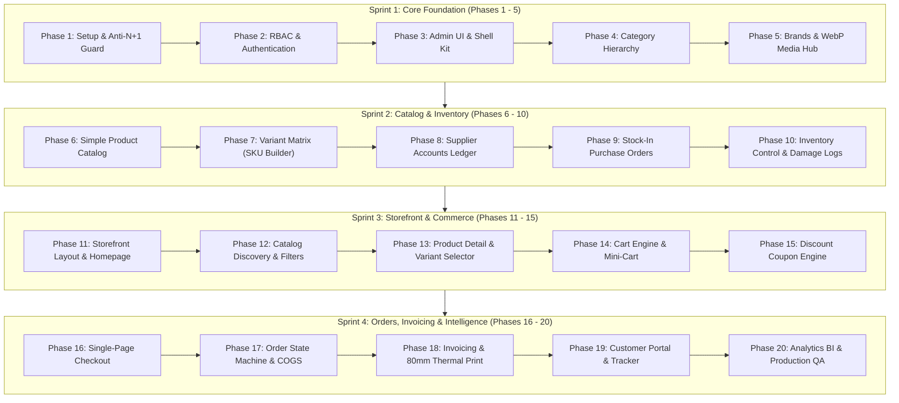

# 20-PHASE COMPLETE DEVELOPMENT & VERIFICATION ROADMAP
## Enterprise Single-Vendor E-Commerce Platform
**Lead Architect & Author:** Jahidul Islam (jahidcse181@gmail.com)  
**Target Architecture:** Laravel 11.x/12.x (MVC + Services) + React 18+ (Inertia.js) + Tailwind CSS + MySQL 8.0 + Redis  

---

## 🧭 ROADMAP STRUCTURE OVERVIEW



---

## 🚀 PHASE-BY-PHASE DETAILED SPECIFICATIONS

---

### 🔹 PHASE 1: PROJECT SETUP, INERTIA BRIDGE & ANTI-N+1 PERFORMANCE RULES
* **Objective:** Establish the development foundation with strict architectural guardrails to prevent performance degradation.
* **Core Tasks:**
  1. Initialize Laravel 11/12 with Inertia.js React adapter and Tailwind CSS 3.4+.
  2. Configure `AppServiceProvider.php` with strict model enforcement:
     ```php
     Model::preventLazyLoading(! app()->isProduction());
     Model::preventSilentlyDiscardingAttributes(! app()->isProduction());
     Model::preventAccessingMissingAttributes(! app()->isProduction());
     ```
  3. Configure MySQL database and Redis connection drivers in `.env`.
  4. Setup Vite Hot Module Replacement (HMR) and alias path mappings (`@/Components`, `@/Layouts`).
* **🧪 Verification Checkpoint:**
  - Run `php artisan migrate` $\to$ connects without errors.
  - Trigger an un-eager loaded relationship in local environment $\to$ Laravel successfully throws `LazyLoadingViolationException`.

---

### 🔹 PHASE 2: ROLE-BASED ACCESS CONTROL (RBAC) & USER AUTHENTICATION
* **Objective:** Implement secure multi-role authentication distinguishing administrative staff from customers.
* **Core Tasks:**
  1. Update `users` table migration: Add `role` enum (`super_admin`, `admin`, `manager`, `inventory_staff`, `customer`), `phone` index, and `is_active` boolean.
  2. Build Authentication controllers: Register, Login, Logout, and Password Reset.
  3. Create Role Middleware (`EnsureAdminAccess.php`) guarding `/admin/*` routes.
* **🧪 Verification Checkpoint:**
  - Register as a customer $\to$ redirected to storefront customer view.
  - Log in as admin $\to$ redirected to `/admin/dashboard`.
  - Attempt customer login on `/admin/*` $\to$ rejected with `403 Forbidden`.

---

### 🔹 PHASE 3: ADMIN DASHBOARD SHELL & UI COMPONENT SYSTEM
* **Objective:** Build a responsive, reusable administrative UI shell with toast messaging.
* **Core Tasks:**
  1. Build `AdminLayout.jsx` with collapsible desktop sidebar, mobile overlay drawer, top search, and user profile dropdown.
  2. Build shared UI components: `Button.jsx`, `Modal.jsx`, `DataTable.jsx`, `Badge.jsx`, `FormInput.jsx`.
  3. Create global flash toast notification listener hooked to Inertia `$page.props.flash`.
* **🧪 Verification Checkpoint:**
  - Resize screen to mobile width $\to$ sidebar collapses behind hamburger toggle.
  - Flash session message from controller $\to$ green toast pop-up appears in top-right.

---

### 🔹 PHASE 4: CATEGORY TAXONOMY & SELF-REFERENCING TREE
* **Objective:** Enable hierarchical categorization (parent categories and nested subcategories).
* **Core Tasks:**
  1. Create `categories` migration: `id`, `parent_id` (foreign key $\to$ `categories.id`), `name`, `slug` (unique), `image`, `description`, `display_order`, `is_active`, `is_featured`.
  2. Build Category CRUD in React with tree indentation and live slug generator.
* **🧪 Verification Checkpoint:**
  - Create parent "Men" $\to$ create subcategory "Shirts" with parent "Men".
  - Verify database foreign key relationship and nested rendering in category list.

---

### 🔹 PHASE 5: BRAND CATALOG & WEBP MEDIA HUB
* **Objective:** Manage brand catalog and automate modern image optimization.
* **Core Tasks:**
  1. Create `brands` migration: `name`, `slug` (unique), `logo`, `is_active`.
  2. Build `MediaUploadService.php`:
     - Validates image dimensions, strips EXIF metadata, resizes to max 1600px width, and converts to `.webp` format.
  3. Build Brand Management UI in Admin.
* **🧪 Verification Checkpoint:**
  - Upload a 3MB JPEG brand logo $\to$ stored in `storage/app/public/` as a `<150KB` optimized WebP image.

---

### 🔹 PHASE 6: CORE PRODUCT CATALOG (SIMPLE / SINGLE PRODUCTS)
* **Objective:** Catalog management for single non-variant products with complete pricing and cost records.
* **Core Tasks:**
  1. Create `products` migration: `name`, `slug`, `sku_code`, `barcode`, `has_variants = 0`, `cost_price`, `selling_price`, `discount_price`, `stock_quantity`, `low_stock_threshold`, `short_description`, `long_description`, `thumbnail`, `is_active`, `is_featured`.
  2. Create `ProductStoreRequest` with strict numeric validation (`selling_price >= cost_price`).
  3. Build Simple Product create/edit interface with drag-and-drop thumbnail uploader.
* **🧪 Verification Checkpoint:**
  - Create simple product $\to$ verify record in `products` table with generated SKU and initial stock.

---

### 🔹 PHASE 7: PRODUCT ATTRIBUTE MATRIX & VARIANT SKU BUILDER
* **Objective:** Manage multi-attribute configurable products using an automated Cartesian permutation generator.
* **Core Tasks:**
  1. Create `product_variants` and `product_images` migrations.
  2. Build `VariantMatrixBuilder.jsx` in React:
     - User inputs attributes (e.g. Color: [Black, White], Size: [S, M, L]).
     - Auto-generates all $2 \times 3 = 6$ variant combinations with individual SKU, Cost, Price, and Stock fields.
  3. Implement `StoreProductAction` wrapping product and variant creation in `DB::transaction()`.
* **🧪 Verification Checkpoint:**
  - Submit a 6-variant product $\to$ verify 1 row in `products` (`has_variants = 1`) and 6 rows in `product_variants`.

---

### 🔹 PHASE 8: SUPPLIER DIRECTORY & ACCOUNTS PAYABLE
* **Objective:** Track supplier business profiles, purchase histories, and liability balances.
* **Core Tasks:**
  1. Create `suppliers` migration: `name`, `company_name`, `phone`, `email`, `address`, `total_purchased_amount`, `total_paid_amount`, `total_due_balance`, `is_active`.
  2. Build Supplier Directory UI with Add/Edit modals and balance summary cards.
* **🧪 Verification Checkpoint:**
  - Create supplier "Prime Textiles" $\to$ verify directory row created with initial due balance `$0.00`.

---

### 🔹 PHASE 9: STOCK-IN PURCHASE ORDERS (INVENTORY HYDRATION)
* **Objective:** Record supplier shipments, update product unit cost price (COGS), and hydrate inventory atomically.
* **Core Tasks:**
  1. Create `purchases` and `purchase_items` migrations with unique PO numbers.
  2. Implement `ReceivePurchaseOrderAction.php`:
     - Increments product/variant live stock count.
     - Updates product's current cost price snapshot.
     - Logs `purchase_in` in stock ledger.
     - Updates supplier's `total_due_balance`.
  3. Build Stock-In Purchase Order UI in Admin.
* **🧪 Verification Checkpoint:**
  - Create Purchase Order for 40 units of Item A @ $12 $\to$ verify item stock increases by 40 and supplier balance updates.

---

### 🔹 PHASE 10: INVENTORY CONTROL, DAMAGE LOGS & LOW-STOCK ALERTS
* **Objective:** Provide full inventory traceability, manual count reconciliations, and low-stock warning triggers.
* **Core Tasks:**
  1. Create `stock_movements` immutable audit table.
  2. Build `StockAdjustmentAction.php` for manual count adjustments and damaged goods write-offs (`damage_out`).
  3. Build Stock Movement History Ledger in Admin with date, SKU, and user filters.
  4. Create Low-Stock Alert notification widget in top navigation bar.
* **🧪 Verification Checkpoint:**
  - Log 2 damaged items $\to$ live stock drops by 2, logged in audit ledger with admin remarks.
  - Set product threshold to 5 (stock = 3) $\to$ low-stock badge lights up on admin topbar.

---

### 🔹 PHASE 11: STOREFRONT MASTER LAYOUT & HOMEPAGE
* **Objective:** Build a responsive, high-converting customer storefront entrance.
* **Core Tasks:**
  1. Build Storefront Header (Logo, Search, Category Navigation, Cart Drawer Trigger, Mobile Bottom Nav).
  2. Build Homepage: Hero slider banner, Featured Categories grid, Trending Products carousel, and Flash Deals banner.
* **🧪 Verification Checkpoint:**
  - View on Mobile & Desktop $\to$ verify touch-friendly layout, navigation, and banners.

---

### 🔹 PHASE 12: CATALOG DISCOVERY, LIVE SEARCH & MULTI-FACET FILTERING
* **Objective:** Ultra-fast product discovery with instant multi-parameter filtering.
* **Core Tasks:**
  1. Build Shop / Catalog page with sidebar filters:
     - Categories checklist, Brand checklist, Price range slider (Min/Max), In-Stock only switch.
  2. Synchronize filters with URL query parameters (`/shop?category=mens&min=20&max=100`).
  3. Implement debounced live search dropdown (250ms delay).
* **🧪 Verification Checkpoint:**
  - Adjust price filter $\to$ URL updates and product list refreshes instantly without full page reload.

---

### 🔹 PHASE 13: PRODUCT DETAIL PAGE & DYNAMIC VARIANT SELECTOR
* **Objective:** Present products in high fidelity with real-time price and stock switching on variant selection.
* **Core Tasks:**
  1. Build Product Details Page with thumbnail switcher and zoom modal.
  2. Build `VariantSelector.jsx`:
     - Color swatches & Size buttons.
     - Selecting variant dynamically updates displayed Price, SKU, and Stock Status (*In Stock* or *Out of Stock*).
  3. Add Stock Urgency Indicator (*"Only 3 left in stock!"*) and Related Products carousel.
* **🧪 Verification Checkpoint:**
  - Click on "Black / L" variant $\to$ price and SKU change dynamically; out-of-stock options disable "Add to Cart".

---

### 🔹 PHASE 14: CART ENGINE, REDIS SESSIONS & MINI-CART DRAWER
* **Objective:** Frictionless shopping cart with instant quantity adjustments.
* **Core Tasks:**
  1. Build `CartSessionManager.php` supporting guest Redis sessions and automatic customer database sync upon login.
  2. Build slide-out Mini-Cart drawer with live subtotal calculation, quantity (+/-) controls, and item removal.
* **🧪 Verification Checkpoint:**
  - Add item to cart $\to$ mini-cart slides open showing updated subtotal; persists across page navigations.

---

### 🔹 PHASE 15: DISCOUNT COUPON ENGINE & PROMO RULES
* **Objective:** Boost sales conversion via targeted promotional discount codes.
* **Core Tasks:**
  1. Create `coupons` migration: `code`, `discount_type` (`percentage`/`fixed`), `discount_value`, `min_order_amount`, `max_discount_cap`, `usage_limit_total`, `usage_limit_per_user`, `start_date`, `end_date`, `is_active`.
  2. Implement `CouponValidationService.php` to validate expiry, limits, and order eligibility.
  3. Build Coupon input widget in mini-cart and checkout.
* **🧪 Verification Checkpoint:**
  - Apply 15% discount code $\to$ calculates discount accurately and prevents application if minimum spend not met.

---

### 🔹 PHASE 16: SINGLE-PAGE CHECKOUT & PAYMENT METHOD SELECTOR
* **Objective:** Frictionless checkout form designed for maximum conversion.
* **Core Tasks:**
  1. Build Single-Page Checkout form:
     - Customer Contact, Delivery Address (Division/City/Street), Customer Notes.
     - Payment Selector: Cash on Delivery (COD) and Direct Bank / MFS Manual Transfer.
     - Order Summary Box with Subtotal, VAT/Tax, Shipping Charge, Coupon Savings, and Grand Total.
  2. Add backend rate limiting (`throttle:10,1`).
* **🧪 Verification Checkpoint:**
  - Fill checkout as Guest $\to$ form validates inputs and prepares order submission cleanly.

---

### 🔹 PHASE 17: ORDER PROCESSING & LIFECYCLE STATE MACHINE
* **Objective:** Execute atomic order creation with COGS profit snapshotting and strict fulfillment workflows.
* **Core Tasks:**
  1. Create `orders`, `order_items`, and `order_status_histories` migrations.
  2. Implement `CreateOrderAction.php`:
     - Snapshots delivery address JSON and unit cost prices.
     - Decrements live inventory (`sale_out`).
     - Calculates Gross Profit: $(\text{Subtotal} - \text{Discount}) - \text{Total COGS}$.
     - Clears cart.
  3. Implement `UpdateOrderStatusAction.php`:
     - Transitions: `pending` $\to$ `confirmed` $\to$ `processing` $\to$ `shipped` $\to$ `delivered`.
     - Automated inventory restock rollback on `cancelled` or `returned` status.
* **🧪 Verification Checkpoint:**
  - Place order $\to$ stock drops by ordered quantity $\to$ cancel order from admin $\to$ stock restored automatically.

---

### 🔹 PHASE 18: DUAL INVOICING ENGINE (A4 PDF & 80MM POS THERMAL PRINT)
* **Objective:** Streamline warehouse packing and official billing with dual invoice formats.
* **Core Tasks:**
  1. Build High-Resolution A4 Tax Invoice PDF template (Store branding, VAT/BIN, itemized breakdown, signature).
  2. Build Compact 80mm POS Thermal Receipt layout (`@media print` CSS) with order barcode for quick dispatch.
  3. Integrate 1-click print buttons in Admin Order View and Customer Portal.
* **🧪 Verification Checkpoint:**
  - Click "Print 80mm Receipt" $\to$ opens print preview fitted to 80mm thermal roll without overflow.

---

### 🔹 PHASE 19: CUSTOMER ACCOUNT PORTAL & VISUAL ORDER TRACKER
* **Objective:** Self-service portal for tracking shipments, reviewing invoices, and saving addresses.
* **Core Tasks:**
  1. Build Customer Dashboard with order history table, status pills, and 1-click invoice downloads.
  2. Build Visual Order Tracking Progress Timeline (*Placed $\to$ Verified $\to$ Packing $\to$ Handed to Courier $\to$ Delivered*).
  3. Build Address Book Manager (multiple shipping addresses with default selector).
* **🧪 Verification Checkpoint:**
  - Customer logs in $\to$ tracks live order status matching the admin backend state in real time.

---

### 🔹 PHASE 20: DYNAMIC SETTINGS CMS (ZERO HARDCODING), BUSINESS INTELLIGENCE & PRODUCTION QA
* **Objective:** Complete centralized dynamic content management (eliminating all hardcoded assets), executive financial visibility, immutable audit logging, and production readiness.
* **Core Tasks:**
  1. **Dynamic Content & Settings CMS Engine (Zero Hardcoded Content):**
     - **Site Identity:** Manage Site Name, Tagline, Main Logo, White Logo, Favicon, Copyright text.
     - **Contact & Support:** Phone numbers, WhatsApp helpline, Support Email, Warehouse address, Google Maps embed URL.
     - **Social Media:** Links for Facebook, Instagram, YouTube, TikTok, LinkedIn, Twitter/X.
     - **Commerce Configs:** Default Currency Symbol/Code/Position, VAT/Tax rate %, Standard Delivery charge, Free Shipping threshold, Low-stock alert threshold.
     - **Invoice Customization:** Legal Company Name, VAT/BIN registration number, invoice terms & footer notices.
     - **Homepage Banner CMS:** Manage Hero slider items (images, headings, sub-titles, button URLs), Promo banners, and Announcement top ticker.
     - **Dynamic Policy Pages:** Full WYSIWYG editor for About Us, Terms & Conditions, Privacy Policy, Return & Refund Policy, FAQ.
     - **Global Shared Props:** Settings cached in Redis and shared via `HandleInertiaRequests.php` (`$page.props.settings`) with zero duplicate queries.
  2. **Business Analytics BI:**
     - Gross/Net Sales, Real Profit Margins ($\text{Revenue} - \text{COGS}$), MoM/YoY growth rate comparisons.
     - Dead Stock Report (products unsold for 60+ days with locked capital).
     - Interactive ApexCharts on Admin Dashboard.
  3. **Audit Trail:** `activity_logs` migration and Eloquent observer recording before/after values on all admin mutations.
  4. **Production QA:** Comprehensive `DatabaseSeeder.php` with realistic demo data.
* **🧪 Verification Checkpoint:**
  - Update Logo, Phone, Currency Symbol, and Hero Banner in Admin $\to$ verify instantaneous reflection across entire storefront header, footer, checkout, and invoices without any hardcoded text.
  - Run `php artisan test` $\to$ all automated tests pass.
  - Run `php artisan db:seed` $\to$ fully hydrates realistic store ready for client sign-off.

---

## 📊 20-PHASE COMPLETION MATRIX

| Phase # | Phase Title | Deliverable Scope | Estimated Effort |
| :---: | :--- | :--- | :---: |
| **Phase 1** | Foundation & Anti-N+1 Rules | Laravel + Inertia React + Strict Models + Redis | 2.5 Hours |
| **Phase 2** | RBAC & User Authentication | Multi-Role Auth (`super_admin`, `staff`, `customer`) | 2.5 Hours |
| **Phase 3** | Admin Dashboard Shell & UI Kit | Responsive Admin Layout + Global Toast Alerts | 2.5 Hours |
| **Phase 4** | Category Hierarchy & Tree | Parent/Child Category Tree with Slug Generator | 2.0 Hours |
| **Phase 5** | Brand Catalog & WebP Media Hub | Brand Management + Auto WebP Image Optimizer | 2.0 Hours |
| **Phase 6** | Simple Product Catalog | Single SKU Product CRUD + Rich Text + Validation | 2.5 Hours |
| **Phase 7** | Variant Matrix & SKU Builder | Cartesian Matrix Permutation SKU Generator | 3.5 Hours |
| **Phase 8** | Supplier Directory & Ledger | Supplier Directory + Payable Balance Ledger | 2.0 Hours |
| **Phase 9** | Stock-In Purchase Orders | Purchase Order Entry + Stock Hydration + COGS | 3.0 Hours |
| **Phase 10** | Inventory Ledger & Adjustments | Damage Logs + Adjustment Actions + Low Stock Alert | 2.5 Hours |
| **Phase 11** | Storefront Layout & Homepage | Responsive Storefront + Hero Banner + Carousels | 3.0 Hours |
| **Phase 12** | Catalog Filters & Live Search | Debounced Search + URL-Synced Facet Filtering | 3.0 Hours |
| **Phase 13** | Product Detail & Variant Selector | Image Zoom + Reactive Swatches + Stock Urgency | 2.5 Hours |
| **Phase 14** | Cart Engine & Mini-Cart Drawer | Redis Cart + Slide-Out Drawer + Instant Subtotal | 2.5 Hours |
| **Phase 15** | Discount Coupon Engine | Promo Code Engine + Min Spend / Cap Validations | 2.0 Hours |
| **Phase 16** | Single-Page Checkout | Conversion-Focused Checkout + COD & Bank Transfer | 3.0 Hours |
| **Phase 17** | Order Hub & State Machine | Order Placement + Profit Snapshot + Restock Rollback | 3.5 Hours |
| **Phase 18** | Invoicing & 80mm Thermal Print | Branded A4 PDF Invoice + POS Thermal Receipt | 2.5 Hours |
| **Phase 19** | Customer Portal & Order Tracker | Order History + Visual Status Tracker + Addresses | 2.5 Hours |
| **Phase 20** | Analytics BI, Audit Log & QA | Gross Profit BI + Activity Audit + Database Seeder | 3.5 Hours |
| **TOTAL** | **Full Enterprise Platform** | **20 Discrete Operational Phases** | **~54 Hours** |

---

*This roadmap is saved at: `docs/20_PHASE_DEVELOPMENT_ROADMAP.md`.*
