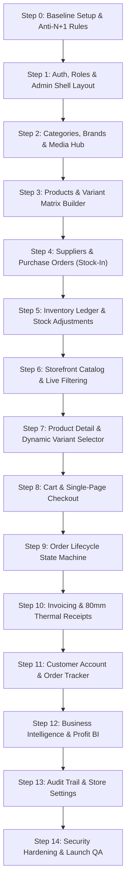

# STEP-BY-STEP DEVELOPMENT & TEST VERIFICATION TRACKER
## Enterprise Single-Vendor E-Commerce Platform
**Architect & Lead:** Jahidul Islam (jahidcse181@gmail.com)  
**Stack:** Laravel 11.x/12.x (MVC + Services) + React.js 18+ (Inertia.js) + Tailwind CSS + MySQL 8.0  

---

## 🎯 HOW TO USE THIS TRACKER
Each step is designed to be **isolated, measurable, and testable**. Do not proceed to the next step until all test checkboxes in the current step pass with green status.

---



---

## 📋 STEP 0: BASELINE INFRASTRUCTURE & ANTI-N+1 CONFIGURATION
**Goal:** Initialize clean Laravel + React (Inertia) + Tailwind setup with strict performance guardrails.

### Tasks to Implement:
1. Initialize Laravel with Inertia React preset:
   ```bash
   composer require inertiajs/inertia-laravel
   npm install @inertiajs/react react react-dom @vitejs/plugin-react
   npm install -D tailwindcss postcss autoprefixer
   npx tailwindcss init -p
   ```
2. Configure `AppServiceProvider.php` with anti-N+1 enforcement:
   ```php
   Model::preventLazyLoading(! app()->isProduction());
   Model::preventSilentlyDiscardingAttributes(! app()->isProduction());
   Model::preventAccessingMissingAttributes(! app()->isProduction());
   ```
3. Set up MySQL database in `.env` and configure Redis cache/queue drivers.
4. Configure standard layout aliases and theme tokens in `tailwind.config.js`.

### 🧪 Test & Verification Checkpoints:
- [ ] Run `php artisan migrate` -> connects to MySQL without errors.
- [ ] Run `npm run build` -> compiles Vite bundle cleanly without warning.
- [ ] Access root URL -> renders blank React landing page with Tailwind styling.
- [ ] Trigger an intentional lazy load query in local environment -> confirms Laravel throws `LazyLoadingViolationException` as expected.

---

## 📋 STEP 1: AUTHENTICATION, RBAC & ADMIN DASHBOARD SHELL
**Goal:** Secure multi-role authentication (Admin, Manager, Staff, Customer) and responsive Admin Layout.

### Tasks to Implement:
1. Create User migration with `role` enum and `is_active` boolean.
2. Implement Auth controllers (Login, Register, Password Reset, Logout).
3. Create Role Middleware (`EnsureUserHasRole.php`) to guard `/admin/*` routes.
4. Build responsive Admin Shell Layout in React:
   - Collapsible desktop & mobile sidebar navigation.
   - Top navigation bar (notifications bell, profile dropdown, quick links).
   - Global Toast Notification container (`react-toastify` or custom Tailwind toast).

### 🧪 Test & Verification Checkpoints:
- [ ] Register a customer account -> redirected to storefront with customer session.
- [ ] Log in as admin user -> redirected to `/admin/dashboard`.
- [ ] Attempt to access `/admin/*` as customer or unauthenticated user -> redirected with `403 Forbidden` or `Login` page.
- [ ] Test mobile toggle button on admin sidebar -> smooth slide-in and backdrop click dismissal.

---

## 📋 STEP 2: CATEGORY TREE, BRANDS & MEDIA UPLOADER
**Goal:** Hierarchical category management (parent/child subcategories) and brand catalog.

### Tasks to Implement:
1. Create `categories` migration with `parent_id` (self-referencing foreign key), `slug`, `image`, `display_order`, `is_active`.
2. Create `brands` migration with `name`, `slug`, `logo`, `is_active`.
3. Create `MediaUploadService` for image optimization, thumbnail generation, and WebP conversion.
4. Build Category & Brand React CRUD pages with drag-and-drop image upload and live slug preview.

### 🧪 Test & Verification Checkpoints:
- [ ] Create Parent Category ("Men's Fashion") -> creates record with slug `mens-fashion`.
- [ ] Create Subcategory ("T-Shirts") under "Men's Fashion" -> confirms `parent_id` correctly points to parent.
- [ ] Delete a category that has subcategories -> system warns or cascades properly according to rules.
- [ ] Upload oversized JPEG image -> confirms optimized WebP file is stored on disk.

---

## 📋 STEP 3: PRODUCT CATALOG & VARIANT MATRIX BUILDER
**Goal:** Support both Simple Products and Configurable Variant Products (Cartesian Matrix SKU generator).

### Tasks to Implement:
1. Create migrations:
   - `products` (name, slug, sku_code, barcode, cost_price, selling_price, discount_price, stock_quantity, low_stock_threshold, descriptions, thumbnail, is_active).
   - `product_variants` (product_id, sku, variant_name, attributes_json, cost_price, selling_price, discount_price, stock_quantity, image).
   - `product_images` (gallery images with sort order).
2. Build **Cartesian Variant Matrix Builder** in React:
   - Input attributes (e.g. Color: Red, Blue | Size: M, L, XL).
   - Auto-generate all permutations (6 variant rows) with editable SKU, cost price, selling price, and stock inputs.
3. Implement `ProductStoreRequest` and `ProductUpdateRequest` with strict validation rules.

### 🧪 Test & Verification Checkpoints:
- [ ] Create a simple product with single SKU -> verify database record in `products` table.
- [ ] Create variant product with Color $\times$ Size -> verify 6 rows created in `product_variants` table.
- [ ] Verify each variant has a unique SKU generated (e.g. `TSHIRT-RED-M`).
- [ ] Update variant prices in bulk -> verify instant state synchronization in React table.

---

## 📋 STEP 4: SUPPLIER MANAGEMENT & PURCHASE ORDERS (STOCK-IN)
**Goal:** Track suppliers, cost per batch, accounts payable, and automate stock hydration upon receiving shipments.

### Tasks to Implement:
1. Create `suppliers` migration (name, company, phone, email, total_purchased, total_paid, due_balance).
2. Create `purchases` and `purchase_items` migrations.
3. Build `SupplierPurchaseService` with atomic database transactions:
   ```php
   DB::transaction(function() use ($dto) {
       // 1. Insert Purchase Record (PO Number)
       // 2. Insert Purchase Items
       // 3. Increment Product/Variant Stock
       // 4. Update Product Unit Cost Price
       // 5. Log Stock Movement Type: 'purchase_in'
       // 6. Record Supplier Payable / Paid Transaction
   });
   ```
4. Build Admin Purchase Order Create UI (Select supplier, search products, add quantity, unit cost price, paid amount).

### 🧪 Test & Verification Checkpoints:
- [ ] Create a Purchase Order for 50 units of Product A @ $10/unit -> verify product stock increases by 50.
- [ ] Check `stock_movements` table -> confirms `movement_type = purchase_in`, `quantity = +50`.
- [ ] Enter a partial payment ($300 paid on $500 total) -> verify supplier due balance shows $200.
- [ ] Simulate database failure midway -> verify full transaction rollback (zero ghost stock created).

---

## 📋 STEP 5: INVENTORY LEDGER, STOCK ADJUSTMENTS & LOW-STOCK ALERTS
**Goal:** Comprehensive inventory management, manual stock count reconciliation, damage write-offs, and alert triggers.

### Tasks to Implement:
1. Create `StockAdjustmentAction` to handle `manual_adjustment_in`, `manual_adjustment_out`, and `damage_out`.
2. Build Inventory Overview page with live stock levels, total stock valuation ($\text{Stock} \times \text{Cost Price}$), and low-stock badge.
3. Build Stock Movement History Ledger with filters by date, SKU, movement type, and user ID.
4. Implement Low Stock Notification Widget in Admin Topbar and Dashboard.

### 🧪 Test & Verification Checkpoints:
- [ ] Perform a manual adjustment for 2 damaged units -> verify live stock decreases by 2.
- [ ] Check audit log -> records `damage_out` with admin notes and previous/current stock count snapshots.
- [ ] Set product low-stock threshold to 5 and reduce stock to 3 -> verify warning badge appears on dashboard.
- [ ] Filter stock movements by date range -> verify accurate filtered results without N+1 queries.

---

## 📋 STEP 6: STOREFRONT CATALOG, SEARCH & MULTI-FACET FILTERING
**Goal:** High-conversion, ultra-fast customer storefront with instant multi-criteria filtering.

### Tasks to Implement:
1. Build Storefront Header, Navigation, and Mobile Bottom Navigation Bar.
2. Build Homepage with Hero Slider, Featured Categories, Flash Deals, and New Arrivals.
3. Build Catalog / Shop Page with React state synchronized with browser URL parameters:
   - Filter by Category (nested support).
   - Filter by Brand.
   - Price range slider (Min / Max).
   - Filter by In-Stock only.
   - Sort by: Newest, Price Low to High, Price High to Low, Most Popular.
4. Implement backend `ProductQueryBuilder` using indexed scopes.

### 🧪 Test & Verification Checkpoints:
- [ ] Select a Category and Price range -> URL updates to `?category=mens&min_price=20&max_price=100`.
- [ ] Refresh page with query string -> filters re-hydrate accurately from URL.
- [ ] Search for a product keyword in search bar -> live search debounces and displays matching results in <150ms.
- [ ] Verify query execution time using Laravel Debugbar/Telescope -> ensures 0 duplicate queries and full index usage.

---

## 📋 STEP 7: PRODUCT DETAIL PAGE & DYNAMIC VARIANT SELECTOR
**Goal:** Detailed product presentation with instant price, stock, and SKU switching upon variant selection.

### Tasks to Implement:
1. Build Product Details Page with responsive gallery and thumbnail switcher.
2. Build `VariantSelector.jsx` component:
   - Visual color swatches and size buttons.
   - Disable unavailable / out-of-stock attribute combinations dynamically.
   - Dynamically update displayed Selling Price, Discounted Price, SKU, and Stock Status based on selected variant.
3. Build Stock Urgency Indicator (e.g., *"Only 2 left in stock!"*).
4. Add "Related Products" recommendation carousel.

### 🧪 Test & Verification Checkpoints:
- [ ] Click on "Red" color -> gallery switches to the red variant thumbnail.
- [ ] Click on "XL" size -> price updates if variant has custom pricing.
- [ ] Select an out-of-stock variant -> "Add to Cart" button automatically disables with "Out of Stock" state.
- [ ] Test on iPhone/Android viewport -> touch-friendly image swipe and button taps.

---

## 📋 STEP 8: CART ENGINE, COUPON SYSTEM & SINGLE-PAGE CHECKOUT
**Goal:** Frictionless cart management and single-page checkout supporting guest and authenticated users.

### Tasks to Implement:
1. Create `CartSessionManager` supporting session cart (for guests) and database/Redis sync (for logged-in users).
2. Build Slide-out Mini Cart drawer with live subtotal calculation, quantity modifier, and item removal.
3. Create `coupons` table and `CouponValidationService`:
   - Validate coupon validity date, minimum spend, usage limits, and customer eligibility.
4. Build Single-Page Checkout form:
   - Contact info (Name, Phone, Email).
   - Shipping address fields with city/district selector.
   - Coupon input box with instant validation.
   - Payment method selector: Cash on Delivery (COD) and Manual Bank/MFS.
   - Order summary box with itemized breakdowns.

### 🧪 Test & Verification Checkpoints:
- [ ] Add item to cart as Guest -> item appears in slide-out cart.
- [ ] Modify quantity -> subtotal recalculates instantly without full page refresh.
- [ ] Apply valid coupon code (e.g. `SAVE10`) -> verify discount deduction and max cap rules.
- [ ] Apply expired or below-minimum coupon -> verify clean human-readable error toast.
- [ ] Log in after adding items as guest -> verify cart items persist into user session.

---

## 📋 STEP 9: ORDER PROCESSING & LIFECYCLE STATE MACHINE
**Goal:** Secure order placement, instant stock reservation, gross profit snapshotting, and strict status workflows.

### Tasks to Implement:
1. Create `orders`, `order_items`, and `order_status_histories` tables.
2. Implement `CreateOrderAction` with atomic transaction:
   ```php
   DB::transaction(function() use ($cart, $customerData) {
       // 1. Generate Unique Order Number (ORD-YYYYMMDD-XXXX)
       // 2. Snapshot Customer Address and Contact
       // 3. Insert Order Record
       // 4. Insert Order Items (with unit cost snapshot and profit)
       // 5. Decrement Live Product / Variant Inventory
       // 6. Log Stock Movement Type: 'sale_out'
       // 7. Insert Initial Status History: 'pending'
       // 8. Clear Cart Session
   });
   ```
3. Implement `UpdateOrderStatusAction` with strict transition validation:
   - `pending` $\to$ `confirmed` $\to$ `processing` $\to$ `shipped` $\to$ `delivered`
   - `pending/confirmed` $\to$ `cancelled` (triggers automatic stock rollback: `order_cancel_in`)
   - `delivered` $\to$ `returned` (triggers return inspection & restock: `return_in`)
4. Build Admin Order Detail View with status update dropdown, customer notes, and timeline audit log.

### 🧪 Test & Verification Checkpoints:
- [ ] Place an order for 1 unit of Product A (initial stock = 10) -> live stock becomes 9, order status is `pending`.
- [ ] Cancel the order from Admin -> status becomes `cancelled`, live stock automatically restored to 10.
- [ ] Check `order_status_histories` -> confirms status change logged with timestamp and user ID.
- [ ] Verify `orders.gross_profit` field -> confirms profit equals $(\text{Subtotal} - \text{Discount}) - \text{Total COGS}$.

---

## 📋 STEP 10: INVOICING & THERMAL RECEIPT PRINT ENGINE
**Goal:** Generate formal branded A4 PDF invoices and direct POS 80mm thermal receipts for warehouse packaging.

### Tasks to Implement:
1. Create `InvoicePdfGenerator` using DomPDF or Browsershot with clean vector styling:
   - Company branding, VAT/BIN details, invoice number, customer addresses, itemized rows, grand total in words, authorized signature area.
2. Create POS 80mm Thermal Receipt template with `@media print` CSS rules:
   - Compact 80mm monospace format with scannable order barcode and courier details.
3. Build "Print A4 Invoice" and "Print 80mm Slip" action buttons in Admin Order View and Customer Portal.

### 🧪 Test & Verification Checkpoints:
- [ ] Click "Download Invoice PDF" -> downloads valid PDF file with proper typography, tables, and company logo.
- [ ] Click "Print 80mm Slip" -> opens browser print modal formatted to 80mm thermal paper dimensions with no page overflow.
- [ ] Test invoice rendering on orders with long item lists -> checks that table pagination splits cleanly across pages.

---

## 📋 STEP 11: CUSTOMER ACCOUNT PORTAL & ORDER TRACKING
**Goal:** Self-service customer portal for reviewing orders, live shipment tracking, and profile management.

### Tasks to Implement:
1. Build Customer Dashboard with overview of total orders, reward points, and default addresses.
2. Build Order History List with status pills and order date filters.
3. Build Visual Order Tracking Progress Bar (e.g. *Order Placed $\to$ Verified $\to$ Packing $\to$ On the Way $\to$ Delivered*).
4. Build Saved Address Book (Add/Edit multiple shipping and billing addresses with default toggle).

### 🧪 Test & Verification Checkpoints:
- [ ] Log in as customer -> navigate to `/account/orders` -> displays all historical orders.
- [ ] Click "Track Order" -> shows accurate real-time stage matching admin order status.
- [ ] Download invoice from customer portal -> verifies customer can only download their own invoices (authorization check).
- [ ] Add new address and set as default -> automatically pre-fills on next checkout.

---

## 📋 STEP 12: BUSINESS INTELLIGENCE, FINANCIALS & GROWTH CHARTS
**Goal:** Executive dashboard displaying real gross profit, daily/monthly revenue, MoM/YoY growth rates, and dead stock analysis.

### Tasks to Implement:
1. Build `BusinessAnalyticsService` with cached SQL aggregation queries:
   - Daily, Weekly, Monthly, and Annual Gross vs Net Sales.
   - Real Gross Profit Margin ($\text{Sales} - \text{COGS}$).
   - Average Order Value (AOV) and Order Volume metrics.
   - MoM (Month-over-Month) and YoY (Year-over-Year) growth rate percentage calculations.
   - Top 10 Best-Selling Products by Revenue & Margin.
   - Dead Stock / Aging Inventory Report (Products unsold for 60+ days with locked capital).
2. Integrate ApexCharts / Chart.js in React Admin Dashboard for interactive charts.

### 🧪 Test & Verification Checkpoints:
- [ ] Compare Dashboard Sales Metric with sum of `orders` table -> confirms 100% mathematical accuracy.
- [ ] Toggle date filter on analytics (e.g. "Last 30 Days", "This Month", "Last Year") -> charts re-render dynamically.
- [ ] Verify Dead Stock report -> lists items with 0 sales in past 60 days and shows accurate tied-up capital.
- [ ] Confirm analytics query execution time is <50ms via query caching.

---

## 📋 STEP 13: SYSTEM AUDIT LOGS & GLOBAL STORE CONFIGURATION
**Goal:** Maintain an immutable record of every administrative action and provide central store settings management.

### Tasks to Implement:
1. Create `activity_logs` table and global Eloquent Model Observer to automatically record:
   - User ID, Action Type, Model, Subject ID, IP Address, Device User Agent, Before/After JSON payloads.
2. Build Admin Activity Log Viewer with search by user, action type, and date.
3. Create `settings` table and Admin Settings page:
   - Store name, logo, favicon, contact phone/email, currency symbol, VAT rate, shipping rate tiers, invoice footer text.

### 🧪 Test & Verification Checkpoints:
- [ ] Edit a product price from $100 to $120 -> verify `activity_logs` records old value (`100`) and new value (`120`).
- [ ] Change store currency or VAT rate in Settings -> verify update reflects immediately across storefront checkout and invoices.
- [ ] Test admin role permission check -> non-super-admin users cannot access or alter activity logs.

---

## 📋 STEP 14: SECURITY HARDENING, STRESS TESTING & LAUNCH READINESS
**Goal:** Complete security audit, anti-N+1 query profiling, stress testing, and deployment preparation.

### Tasks to Implement:
1. Run Laravel Pint / PHP CodeSniffer for strict PSR-12 standard enforcement.
2. Audit all database queries with Laravel Telescope -> guarantee zero N+1 queries across catalog, checkout, and admin tables.
3. Configure rate limiting:
   - `throttle:10,1` on login, registration, and checkout submission endpoints.
4. Validate CSRF protection, SQL injection immunity via PDO bindings, and XSS sanitization on rich-text fields.
5. Create sample database seeder (`DatabaseSeeder.php`) with realistic categories, products with variants, suppliers, and test orders.

### 🧪 Test & Verification Checkpoints:
- [ ] Run automated test suite: `php artisan test` -> 100% tests passing.
- [ ] Send 20 rapid checkout requests from automated script -> rate limiter blocks requests above threshold with `429 Too Many Requests`.
- [ ] Run `php artisan db:seed` on clean database -> successfully populates full store ready for client demo.
- [ ] Test complete end-to-end shopping cycle on mobile device from product search to order placement and admin invoice print.

---

## 📊 PROGRESS TRACKING SUMMARY TABLE

| Step # | Milestone Module | Primary Deliverables | Status |
| :---: | :--- | :--- | :---: |
| **Step 0** | Infrastructure & Anti-N+1 | Laravel 11/12 + Inertia React + Tailwind + Strict Models | ⏳ Ready to Start |
| **Step 1** | Auth, RBAC & Admin Shell | Multi-role Auth, Admin Sidebar Layout, Toast System | ⏳ Pending |
| **Step 2** | Categories, Brands & Media | Nested Category Tree, Brand CRUD, WebP Media Hub | ⏳ Pending |
| **Step 3** | Products & Variant Matrix | Product Catalog, Cartesian Permutation SKU Generator | ⏳ Pending |
| **Step 4** | Suppliers & Purchase Orders | Supplier Ledger, Stock-In Purchase Orders, COGS Tracking | ⏳ Pending |
| **Step 5** | Inventory & Stock Movement | Stock Adjustments, Damage Logs, Low-Stock Notification | ⏳ Pending |
| **Step 6** | Storefront Catalog & Filters | Responsive Shop, URL-Synced Multi-Facet Filters, Search | ⏳ Pending |
| **Step 7** | Product Details & Selector | Reactive Color/Size Swatches, Dynamic Price/Stock Sync | ⏳ Pending |
| **Step 8** | Cart & Single-Page Checkout | Slide-out Cart, Coupon Engine, COD/Bank Checkout | ⏳ Pending |
| **Step 9** | Order Fulfillment Engine | Order State Machine, Profit Snapshot, Auto Stock Rollback | ⏳ Pending |
| **Step 10** | Invoices & Thermal Printing | Branded A4 PDF Invoice + 80mm POS Thermal Receipt | ⏳ Pending |
| **Step 11** | Customer Account Portal | Order Tracking Timeline, Invoice Download, Addresses | ⏳ Pending |
| **Step 12** | Business Intelligence & BI | Sales Curves, Real Profit Margins, MoM/YoY, Dead Stock | ⏳ Pending |
| **Step 13** | Audit Trail & Store Settings | Immutable Activity Logs, Dynamic Store Settings Hub | ⏳ Pending |
| **Step 14** | Security & Launch QA | Anti-N+1 Profiling, Rate Limiting, Automated Seeding | ⏳ Pending |

---

*This tracker is saved at: `docs/DEVELOPMENT_STEP_BY_STEP_TRACKER.md`.*
