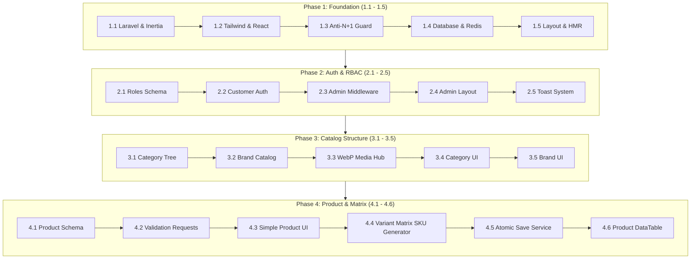

# MICRO-STEP DEVELOPMENT & TEST BLUEPRINT
## Enterprise Single-Vendor E-Commerce Platform
**Author & Lead Architect:** Jahidul Islam (jahidcse181@gmail.com)  
**Target Architecture:** Laravel 11.x/12.x (MVC + Services) + React 18+ (Inertia.js) + Tailwind CSS + MySQL 8.0  

---

## 🧭 HOW TO EXECUTE THIS BLUEPRINT
* Every task is broken into a **15–30 minute micro-step**.
* Each micro-step contains:
  1. **Exact Files / Code to write**
  2. **Exact Command / Verification to run**
  3. **Expected Pass Output** (Green light to proceed)

---



---

## 📦 PHASE 1: BASELINE SETUP & PERFORMANCE GUARDRAILS

### [Micro-Task 1.1] Initialize Laravel & Inertia.js React Package
* **Action:**
  ```bash
  composer require inertiajs/inertia-laravel
  npm install @inertiajs/react react react-dom @vitejs/plugin-react
  ```
* **Configuration:** Create `resources/views/app.blade.php` with `@inertiaHead` and `@inertia`.
* **Test Command:** `php artisan --version`
* **Pass Criteria:** Returns `Laravel Framework 11.x/12.x` with Inertia registered in `composer.json`.

---

### [Micro-Task 1.2] Setup Tailwind CSS & PostCSS
* **Action:**
  ```bash
  npm install -D tailwindcss postcss autoprefixer
  npx tailwindcss init -p
  ```
* **Configuration:** Add paths to `tailwind.config.js`:
  ```js
  content: [
    "./resources/**/*.blade.php",
    "./resources/**/*.jsx",
    "./resources/**/*.js",
  ],
  ```
  Add `@tailwind base; @tailwind components; @tailwind utilities;` to `resources/css/app.css`.
* **Test Command:** `npm run build`
* **Pass Criteria:** Build finishes in `<2s` with generated CSS file.

---

### [Micro-Task 1.3] Configure Strict Anti-N+1 Eloquent Model Rules
* **Action:** Open `app/Providers/AppServiceProvider.php` and add:
  ```php
  use Illuminate\Database\Eloquent\Model;

  public function boot(): void
  {
      Model::preventLazyLoading(! app()->isProduction());
      Model::preventSilentlyDiscardingAttributes(! app()->isProduction());
      Model::preventAccessingMissingAttributes(! app()->isProduction());
  }
  ```
* **Test Command:** Create a temporary test route that calls an un-eager-loaded relation.
* **Pass Criteria:** Laravel throws `LazyLoadingViolationException` in local environment.

---

### [Micro-Task 1.4] Configure MySQL Database & Redis in `.env`
* **Action:** Configure `.env`:
  ```env
  DB_CONNECTION=mysql
  DB_HOST=127.0.0.1
  DB_PORT=3306
  DB_DATABASE=orio_ecommerce
  DB_USERNAME=root
  DB_PASSWORD=

  CACHE_STORE=redis
  QUEUE_CONNECTION=redis
  SESSION_DRIVER=redis
  ```
* **Test Command:** `php artisan migrate`
* **Pass Criteria:** Connects to MySQL and creates standard migrations table without error.

---

### [Micro-Task 1.5] Create Baseline Inertia React Shell & Vite HMR Check
* **Action:** Create `resources/js/app.jsx` and `resources/js/Pages/Welcome.jsx`.
* **Test Command:** Run `npm run dev` and `php artisan serve`, open `http://localhost:8000`.
* **Pass Criteria:** Browser displays styled React page; editing text triggers instant Hot Module Replacement without full reload.

---

## 🔐 PHASE 2: AUTHENTICATION, RBAC & ADMIN LAYOUT

### [Micro-Task 2.1] Update `users` Migration for Role-Based Access Control
* **Action:** Add to `database/migrations/xxxx_create_users_table.php`:
  ```php
  $table->enum('role', ['super_admin', 'admin', 'manager', 'inventory_staff', 'customer'])->default('customer')->index();
  $table->string('phone', 30)->nullable()->index();
  $table->boolean('is_active')->default(true);
  ```
* **Test Command:** `php artisan migrate:fresh`
* **Pass Criteria:** Database table `users` contains `role` and `phone` columns.

---

### [Micro-Task 2.2] Implement Authentication Controllers (Login / Register / Logout)
* **Action:** Create `AuthController.php` with:
  - `showLoginForm()`, `login()`, `showRegisterForm()`, `register()`, `logout()`.
* **Test Command:** Submit registration form at `/register`.
* **Pass Criteria:** New customer user created in DB; session authenticated; redirected to `/`.

---

### [Micro-Task 2.3] Create Role Guard Middleware (`AdminMiddleware.php`)
* **Action:**
  ```bash
  php artisan make:middleware EnsureAdminAccess
  ```
  Check `$request->user() && in_array($request->user()->role, ['super_admin', 'admin', 'manager', 'inventory_staff'])`.
* **Test Command:** Attempt to visit `/admin/dashboard` as a customer user.
* **Pass Criteria:** Returns `403 Forbidden` or redirects to login.

---

### [Micro-Task 2.4] Build Responsive Admin Shell Layout in React
* **Action:** Create `resources/js/Layouts/AdminLayout.jsx`:
  - Desktop collapsible sidebar (Dashboard, Catalog, Purchases, Orders, Analytics, Settings).
  - Mobile slide-over drawer with backdrop overlay.
  - Top header with search bar, notifications bell, user profile menu.
* **Test Verification:** Resize browser to mobile (<640px) $\to$ verify sidebar becomes hidden behind a toggle button.

---

### [Micro-Task 2.5] Create Global Toast Notification Context
* **Action:** Create `resources/js/Components/ToastContainer.jsx` hooked to Inertia `$page.props.flash`.
* **Test Verification:** Return `redirect()->back()->with('success', 'Operation successful!')` from controller $\to$ green toast appears in top-right corner and auto-dismisses in 4 seconds.

---

## 🗂️ PHASE 3: CATEGORY TREE, BRANDS & WEBP MEDIA HUB

### [Micro-Task 3.1] Create `categories` Migration (Self-Referencing Tree)
* **Action:**
  ```php
  $table->id();
  $table->foreignId('parent_id')->nullable()->constrained('categories')->nullOnDelete();
  $table->string('name', 150);
  $table->string('slug', 191)->unique();
  $table->string('image')->nullable();
  $table->text('description')->nullable();
  $table->integer('display_order')->default(0);
  $table->boolean('is_active')->default(true)->index();
  $table->boolean('is_featured')->default(false);
  $table->timestamps();
  ```
* **Test Command:** `php artisan migrate`
* **Pass Criteria:** `categories` table created with self-referencing foreign key.

---

### [Micro-Task 3.2] Create `brands` Migration
* **Action:** Create `brands` table with `id`, `name`, `slug` (unique), `logo`, `is_active`, `timestamps`.
* **Test Command:** `php artisan migrate`
* **Pass Criteria:** `brands` table created successfully.

---

### [Micro-Task 3.3] Build `MediaUploadService.php` (Auto WebP Optimization)
* **Action:** Create `app/Services/Media/MediaUploadService.php`:
  - Validates image dimensions, strips EXIF, resizes to max 1600px width, converts to modern `.webp` format, stores in `storage/app/public/uploads/`.
* **Test Verification:** Upload a 4MB `.jpg` file $\to$ verify it saves as a `<250KB` `.webp` file in storage.

---

### [Micro-Task 3.4] Build Category Management UI (Parent/Child Tree View)
* **Action:** Create `Admin/Categories/Index.jsx` and `CreateEditModal.jsx`:
  - Displays category tree with indentation for child categories.
  - Form with live slug auto-generation from title, parent dropdown selector, and image dropzone.
* **Test Verification:** Create "Electronics" $\to$ create "Smartphones" with parent "Electronics" $\to$ verify nested tree renders correctly.

---

### [Micro-Task 3.5] Build Brand Management CRUD
* **Action:** Create `Admin/Brands/Index.jsx` with modal-based quick Add/Edit and image logo uploader.
* **Test Verification:** Add "Samsung", upload logo $\to$ verify brand row appears in DataTable.

---

## 👗 PHASE 4: PRODUCT CATALOG & VARIANT MATRIX BUILDER

### [Micro-Task 4.1] Create `products`, `product_variants`, & `product_images` Migrations
* **Action:**
  - `products`: name, slug, sku_code, barcode, has_variants, cost_price, selling_price, discount_price, stock_quantity, low_stock_threshold, short_description, long_description, thumbnail, is_active.
  - `product_variants`: product_id, sku, variant_name, attributes_json, cost_price, selling_price, discount_price, stock_quantity, image.
  - `product_images`: product_id, image_path, sort_order, is_primary.
* **Test Command:** `php artisan migrate`
* **Pass Criteria:** All 3 product tables created with cascading foreign keys and indexes.

---

### [Micro-Task 4.2] Create `ProductStoreRequest.php` & `ProductUpdateRequest.php`
* **Action:** Write strict validation rules for simple products vs variant arrays:
  - `name`: required, max 255.
  - `cost_price`: required, numeric, min 0.
  - `selling_price`: required, numeric, gte cost_price.
  - `variants.*.sku`: required_if:has_variants,1, distinct, unique.
* **Test Verification:** Submit invalid price (selling < cost) $\to$ validation returns clean error.

---

### [Micro-Task 4.3] Build Basic Product Creation UI (Single Product Tab)
* **Action:** Create `Admin/Products/Create.jsx`:
  - Title, Category selector, Brand selector, Cost price, Selling price, Discount price, Initial stock, Description, Thumbnail uploader.
* **Test Verification:** Fill form $\to$ submit $\to$ check DB $\to$ single product created with `has_variants = 0`.

---

### [Micro-Task 4.4] Build React Cartesian Variant Matrix Generator
* **Action:** Create `resources/js/Components/Admin/VariantMatrixBuilder.jsx`:
  - Add attribute tags: e.g. `Color: [Black, Navy]` and `Size: [M, L, XL]`.
  - Calculate Cartesian product ($2 \times 3 = 6$ combinations).
  - Dynamically render editable table rows with fields: SKU, Variant Name, Cost, Selling Price, Stock Qty.
* **Test Verification:** Adding 2 colors $\times$ 3 sizes renders exactly 6 variant rows in real time.

---

### [Micro-Task 4.5] Create `StoreProductAction.php` with Atomic Transaction
* **Action:** Wrap product & variant creation in `DB::transaction()`:
  - Inserts product $\to$ inserts variants $\to$ logs initial stock movement $\to$ attaches gallery.
* **Test Verification:** Create product with 6 variants $\to$ verify 1 product record and 6 variant records committed.

---

### [Micro-Task 4.6] Build Admin Product Index DataTable
* **Action:** Create `Admin/Products/Index.jsx`:
  - Thumbnail, Product Name, Category, Base Price, Live Total Stock, Low Stock status pill, Action menu (Edit, Toggle Status, Delete).
  - Search input with 300ms debounce.
* **Test Verification:** Type product name in search $\to$ list filters instantly without full page refresh.

---

## 🏭 PHASE 5: SUPPLIERS & STOCK-IN PURCHASE ORDERS

### [Micro-Task 5.1] Create `suppliers` Migration
* **Action:**
  - `suppliers`: name, company_name, phone, email, address, total_purchased_amount, total_paid_amount, total_due_balance, is_active.
* **Test Command:** `php artisan migrate`
* **Pass Criteria:** `suppliers` table created.

---

### [Micro-Task 5.2] Build Supplier Management UI
* **Action:** Create `Admin/Suppliers/Index.jsx` with DataTable, total balance summary card, and Add/Edit modal.
* **Test Verification:** Add supplier "Apex Fabrics" $\to$ supplier created with initial balance $0.00$.

---

### [Micro-Task 5.3] Create `purchases` and `purchase_items` Migrations
* **Action:**
  - `purchases`: po_number (unique), supplier_id, purchase_date, subtotal_cost, shipping_cost, grand_total, paid_amount, due_amount, payment_status, status.
  - `purchase_items`: purchase_id, product_id, variant_id, quantity, unit_cost_price, subtotal.
* **Test Command:** `php artisan migrate`
* **Pass Criteria:** Tables created with foreign keys.

---

### [Micro-Task 5.4] Implement `ReceivePurchaseOrderAction.php`
* **Action:** Execute stock hydration inside `DB::transaction()`:
  - Generate PO number (e.g. `PO-202609-0001`).
  - For each item: increment `stock_quantity`, update `cost_price`, write to `stock_movements`.
  - Update `suppliers.total_due_balance`.
* **Test Verification:** Purchase 20 units of Item A @ $15 $\to$ verify item stock increases by 20.

---

### [Micro-Task 5.5] Build Admin Stock-In Purchase UI
* **Action:** Create `Admin/Purchases/Create.jsx`:
  - Supplier picker, dynamic row repeater to search and add products/variants, quantity, unit cost price, paid amount input.
* **Test Verification:** Submit form $\to$ redirected to purchase invoice view with calculated subtotal, paid, and due balance.

---

## 📦 PHASE 6: INVENTORY LEDGER, ADJUSTMENTS & ALERTS

### [Micro-Task 6.1] Create `stock_movements` (Immutable Audit Ledger) Migration
* **Action:**
  - `stock_movements`: product_id, variant_id, movement_type (`purchase_in`, `sale_out`, `order_cancel_in`, `return_in`, `manual_adjustment_in`, `manual_adjustment_out`, `damage_out`), quantity, unit_cost, reference_type, reference_id, previous_stock, current_stock, user_id, notes.
* **Test Command:** `php artisan migrate`
* **Pass Criteria:** `stock_movements` table created with compound indexes.

---

### [Micro-Task 6.2] Build `StockAdjustmentAction.php`
* **Action:** Handles manual count discrepancy or damaged inventory write-offs:
  - Decrements/increments live stock and inserts `stock_movements` record with admin explanation.
* **Test Verification:** Write off 3 water-damaged units $\to$ live stock drops by 3, logged as `damage_out`.

---

### [Micro-Task 6.3] Build Inventory Overview & Movement History UI
* **Action:** Create `Admin/Inventory/Index.jsx` and `Movements.jsx`:
  - Filter by SKU, movement type, date range, and staff member.
* **Test Verification:** Filter by `damage_out` $\to$ lists all damaged write-offs with reasons.

---

### [Micro-Task 6.4] Build Real-Time Low-Stock Notification Center
* **Action:** Create query scope `scopeLowStock()` where `stock_quantity <= low_stock_threshold`.
  - Topbar alert bell with badge count showing number of critical items.
* **Test Verification:** Reduce a product's stock below threshold $\to$ topbar badge counter increments by 1.

---

## 🛒 PHASE 7: STOREFRONT CATALOG & MULTI-FACET FILTERING

### [Micro-Task 7.1] Build Storefront Layout & Header Navigation
* **Action:** Create `resources/js/Layouts/StoreLayout.jsx`:
  - Top announcement bar, logo, live search bar, category dropdown menu, wishlist & cart triggers, mobile bottom navigation.
* **Test Verification:** Open on desktop and mobile $\to$ responsive layout adjusts smoothly.

---

### [Micro-Task 7.2] Build Storefront Homepage
* **Action:** Create `Store/Home.jsx`:
  - Hero slider banner, Featured Categories grid, Trending Products carousel, Promotional deal banners.
* **Test Verification:** Products marked `is_featured = 1` populate the trending carousel.

---

### [Micro-Task 7.3] Build Reusable `ProductCard.jsx` Component
* **Action:** Product card with thumbnail, discount badge (% off), title, rating stars, price (with strikethrough if discounted), quick Add-to-Cart trigger.
* **Test Verification:** Renders card cleanly with formatted currency.

---

### [Micro-Task 7.4] Build Shop / Catalog Page with URL-Synced Filters
* **Action:** Create `Store/Shop.jsx`:
  - Sidebar with Category checklist, Brand checklist, Price range slider (Min/Max), and "In Stock Only" toggle.
  - Syncs state with Inertia router (`router.get('/shop', params, { preserveState: true })`).
* **Test Verification:** Change price slider $\to$ URL updates $\to$ catalog updates without page reload.

---

### [Micro-Task 7.5] Build Debounced Live Search Component
* **Action:** Search input with 250ms debounce calling `/api/search/suggestions`.
* **Test Verification:** Type "jean" $\to$ popup dropdown displays top 5 matching products with thumbnail and price.

---

## 🔍 PHASE 8: PRODUCT DETAILS & REACTIVE VARIANT SELECTOR

### [Micro-Task 8.1] Build Product Detail Page Layout
* **Action:** Create `Store/ProductDetails.jsx`:
  - Left: Image gallery with thumbnail switcher and zoom modal.
  - Right: Title, SKU, Brand, Category, Live Price, Variant Selector, Quantity picker, Add to Cart / Buy Now buttons.
* **Test Verification:** Load product page $\to$ displays full details, attributes, and stock status.

---

### [Micro-Task 8.2] Build `VariantSelector.jsx` Component
* **Action:**
  - Color swatches & Size pill buttons.
  - When user selects "Navy" + "L":
    1. Finds matching variant in `product.variants` array.
    2. Updates displayed Price to variant price.
    3. Updates SKU to `TSHIRT-NVY-L`.
    4. Updates displayed stock status (*In Stock (8 units)* or *Out of Stock*).
* **Test Verification:** Select an out-of-stock combination $\to$ "Add to Cart" button automatically disables.

---

### [Micro-Task 8.3] Build Stock Urgency Widget & Related Products
* **Action:** If stock $< 5$, display amber warning: *"Hurry, only 3 items left in stock!"*.
* **Test Verification:** Select variant with 2 items $\to$ urgency badge renders.

---

## 💳 PHASE 9: CART, COUPONS & SINGLE-PAGE CHECKOUT

### [Micro-Task 9.1] Implement `CartSessionManager.php`
* **Action:** Storefront cart backend service:
  - Methods: `add($productId, $variantId, $qty)`, `update($cartKey, $qty)`, `remove($cartKey)`, `clear()`.
  - Stores cart data in Redis session for guests; syncs to database upon customer login.
* **Test Verification:** Add 2 items $\to$ fetch cart $\to$ returns correct subtotal.

---

### [Micro-Task 9.2] Build Slide-Out Mini Cart Drawer in React
* **Action:** Slide-over drawer accessible from any page:
  - Item list, variant labels, price, increment/decrement buttons, remove icon, Subtotal, "Proceed to Checkout" button.
* **Test Verification:** Click "Add to Cart" on any product $\to$ drawer opens automatically showing added item.

---

### [Micro-Task 9.3] Create `coupons` Migration & `CouponValidationService.php`
* **Action:**
  - `coupons`: code, discount_type (`percentage`, `fixed_amount`), discount_value, min_order_amount, max_discount_cap, usage_limit_total, usage_limit_per_user, start_date, end_date, is_active.
* **Test Verification:** Validate code `EID20` (20% off, max cap $50 on $300 order) $\to$ returns accurate $50 discount.

---

### [Micro-Task 9.4] Build Single-Page Checkout UI
* **Action:** Create `Store/Checkout.jsx`:
  - Left column: Customer contact info, Shipping address (Division, District, Street address, Phone), Customer delivery notes.
  - Right column: Item summary, Coupon input with "Apply" button, Shipping cost calculator, Payment selector (Cash on Delivery / Direct Bank Transfer), "Place Order" button.
* **Test Verification:** Check form validation $\to$ missing required fields highlights input borders in red.

---

## 📦 PHASE 10: ORDER PROCESSING & LIFECYCLE STATE MACHINE

### [Micro-Task 10.1] Create `orders`, `order_items`, and `order_status_histories` Migrations
* **Action:**
  - `orders`: order_number, user_id, customer_name, customer_phone, customer_email, shipping_address_json, subtotal, tax_amount, shipping_cost, discount_amount, grand_total, total_cost_price, gross_profit, payment_method, payment_status, order_status (`pending`, `confirmed`, `processing`, `shipped`, `delivered`, `cancelled`, `returned`).
  - `order_items`: order_id, product_id, variant_id, product_name, variant_name, sku, unit_cost_price, unit_selling_price, quantity, subtotal, total_cost.
* **Test Command:** `php artisan migrate`
* **Pass Criteria:** Tables created with foreign keys and composite indexes.

---

### [Micro-Task 10.2] Implement `CreateOrderAction.php` (Atomic Placement)
* **Action:**
  ```php
  DB::transaction(function() use ($cart, $data) {
      // 1. Generate Order Number: ORD-YYYYMMDD-XXXX
      // 2. Snapshot address JSON & COGS
      // 3. Create order & order items
      // 4. Decrement inventory: Log 'sale_out' in stock_movements
      // 5. Calculate Gross Profit: (Subtotal - Discount) - Total COGS
      // 6. Clear Cart
  });
  ```
* **Test Verification:** Submit order for 2 items $\to$ stock decrements by 2 $\to$ order number generated $\to$ cart emptied.

---

### [Micro-Task 10.3] Build Order Success Page
* **Action:** Create `Store/OrderSuccess.jsx` showing order number, summary, payment instructions, and "Track Your Order" button.
* **Test Verification:** Complete checkout $\to$ redirected to confirmation screen.

---

### [Micro-Task 10.4] Build Admin Order Hub DataTable
* **Action:** Create `Admin/Orders/Index.jsx`:
  - Tabs: All, Pending, Confirmed, Processing, Shipped, Delivered, Cancelled.
  - Columns: Order #, Date, Customer, Total, Profit, Payment Status, Order Status, Actions.
* **Test Verification:** Clicking "Pending" tab filters list to pending orders only.

---

### [Micro-Task 10.5] Implement Order State Machine & Cancellation Rollback
* **Action:** Create `UpdateOrderStatusAction.php`:
  - Status change from `pending/confirmed` $\to$ `cancelled` automatically restores stock (`order_cancel_in`).
  - Status change from `delivered` $\to$ `returned` restores stock (`return_in`).
* **Test Verification:** Cancel an order from admin $\to$ verify item stock increments back immediately.

---

## 📄 PHASE 11: INVOICING & THERMAL RECEIPT PRINT ENGINE

### [Micro-Task 11.1] Build Formal A4 Tax Invoice PDF Template
* **Action:** Create `resources/views/invoices/a4_tax_invoice.blade.php`:
  - Store Logo, Official VAT/BIN, Order Number, Customer Info, Itemized table with SKU/Price/Qty/Total, Tax Breakdown, Amount in Words, Authorized Signature.
* **Test Verification:** Generate PDF $\to$ verify crisp vector text and proper table formatting.

---

### [Micro-Task 11.2] Build 80mm POS Thermal Receipt Print Layout
* **Action:** Create `resources/views/invoices/thermal_receipt.blade.php`:
  - Monospace layout formatted for 80mm roll printers with order barcode.
* **Test Verification:** Click "Print 80mm Receipt" $\to$ print preview renders in 80mm thermal receipt format.

---

## 👤 PHASE 12: CUSTOMER ACCOUNT PORTAL

### [Micro-Task 12.1] Build Customer Dashboard & Order History
* **Action:** Create `Customer/Orders.jsx`:
  - Order list with status pills, order date, grand total, "View Details" and "Download Invoice" buttons.
* **Test Verification:** Log in as customer $\to$ view past orders.

---

### [Micro-Task 12.2] Build Visual Order Tracker Progress Timeline
* **Action:** Visual progress step indicator:
  - *Order Placed $\to$ Verified $\to$ Packing $\to$ Handed to Courier $\to$ Delivered*.
* **Test Verification:** Admin updates status to "Shipped" $\to$ customer tracking progress bar updates to "Handed to Courier".

---

### [Micro-Task 12.3] Build Address Book Manager
* **Action:** Create `Customer/Addresses.jsx` for managing multiple shipping addresses with default selector.
* **Test Verification:** Set a default address $\to$ verifies checkout automatically pre-selects it.

---

## 📊 PHASE 13: BUSINESS INTELLIGENCE, FINANCIALS & GROWTH CHARTS

### [Micro-Task 13.1] Build `BusinessAnalyticsService.php`
* **Action:** SQL aggregations with 30-minute Redis caching:
  - Gross Revenue, Net Revenue, Cost of Goods Sold (COGS), Gross Profit Margin.
  - Average Order Value (AOV).
  - Month-over-Month (MoM) & Year-over-Year (YoY) growth percentages.
* **Test Verification:** Call analytics service $\to$ verify mathematical match with DB sums.

---

### [Micro-Task 13.2] Build Dead Stock & High-Velocity Analytics Queries
* **Action:**
  - Top 10 Best Sellers by Quantity & Profit Margin.
  - Dead Stock Report: Products with 0 sales in past 60 days showing total tied-up capital ($\text{Stock} \times \text{Cost Price}$).
* **Test Verification:** Query identifies products with no orders in 60 days.

---

### [Micro-Task 13.3] Build Interactive Executive Dashboard Widgets (ApexCharts)
* **Action:** Create `Admin/Dashboard.jsx`:
  - 4 Key KPI cards (Revenue, Gross Profit, Total Orders, Low Stock Alerts).
  - Daily/Monthly Sales & Profit Margin Area Chart.
  - Top Selling Products Bar Chart.
  - Category Share Donut Chart.
* **Test Verification:** Toggle date filter ("Last 7 Days", "This Month", "This Year") $\to$ charts update dynamically.

---

## 🛡️ PHASE 14: AUDIT TRAIL, STORE SETTINGS & LAUNCH QA

### [Micro-Task 14.1] Create `activity_logs` Migration & Eloquent Observer
* **Action:**
  - `activity_logs`: user_id, action, subject_type, subject_id, old_payload (JSON), new_payload (JSON), ip_address, user_agent, created_at.
  - Automatically records updates on `Product`, `Order`, `Purchase`, and `Setting` models.
* **Test Verification:** Update product price $\to$ activity log stores old and new prices with user ID.

---

### [Micro-Task 14.2] Build Global Store Settings Management
* **Action:** Create `Admin/Settings/Index.jsx`:
  - Store Name, Logo, Favicon, Phone, Email, Currency Symbol, VAT/Tax %, Default Delivery Charges, Invoice Terms.
* **Test Verification:** Change currency symbol $\to$ storefront & invoices update immediately.

---

### [Micro-Task 14.3] Security Hardening & Rate Limiting Audit
* **Action:**
  - Apply `throttle:10,1` on checkout and authentication endpoints.
  - Audit all raw DB queries for parameter binding.
  - Verify CSRF protection on all POST/PUT/DELETE routes.
* **Test Verification:** Send 15 rapid POST requests to `/checkout` $\to$ 11th request receives `429 Too Many Requests`.

---

### [Micro-Task 14.4] Create Comprehensive `DatabaseSeeder.php`
* **Action:** Seeds demo admin user, 10 categories, 5 brands, 25 products (simple & variant), 3 suppliers, 10 purchase orders, 20 customer orders with status histories.
* **Test Command:** `php artisan migrate:fresh --seed`
* **Pass Criteria:** Complete, realistic e-commerce store populated in `<10 seconds` ready for stakeholder demo.

---

## 🏁 MICRO-STEP SUMMARY MATRIX

| Phase | Milestone Name | Micro-Tasks | Estimated Effort |
| :--- | :--- | :---: | :---: |
| **Phase 1** | Foundation & Anti-N+1 | Tasks 1.1 – 1.5 | ~2.5 Hours |
| **Phase 2** | Auth, RBAC & Admin Shell | Tasks 2.1 – 2.5 | ~3.0 Hours |
| **Phase 3** | Category, Brand & Media Hub | Tasks 3.1 – 3.5 | ~3.0 Hours |
| **Phase 4** | Product & Variant Matrix Builder | Tasks 4.1 – 4.6 | ~4.5 Hours |
| **Phase 5** | Suppliers & Stock-In Purchases | Tasks 5.1 – 5.5 | ~3.5 Hours |
| **Phase 6** | Inventory Ledger & Adjustments | Tasks 6.1 – 6.4 | ~2.5 Hours |
| **Phase 7** | Storefront Catalog & Filters | Tasks 7.1 – 7.5 | ~4.0 Hours |
| **Phase 8** | Product Details & Variant Selector | Tasks 8.1 – 8.3 | ~3.0 Hours |
| **Phase 9** | Cart, Coupons & Checkout | Tasks 9.1 – 9.4 | ~4.0 Hours |
| **Phase 10** | Order Hub & State Machine | Tasks 10.1 – 10.5 | ~4.5 Hours |
| **Phase 11** | Invoicing & 80mm Receipts | Tasks 11.1 – 11.2 | ~2.5 Hours |
| **Phase 12** | Customer Portal & Tracking | Tasks 12.1 – 12.3 | ~2.5 Hours |
| **Phase 13** | Analytics & Profit BI | Tasks 13.1 – 13.3 | ~3.5 Hours |
| **Phase 14** | Audit Trail, Settings & Launch QA | Tasks 14.1 – 14.4 | ~3.0 Hours |
| **TOTAL** | **Full Enterprise Platform** | **57 Micro-Tasks** | **~46 Hours** |

---

*This blueprint is saved at: `docs/MICRO_STEP_DEVELOPMENT_BLUEPRINT.md`.*
