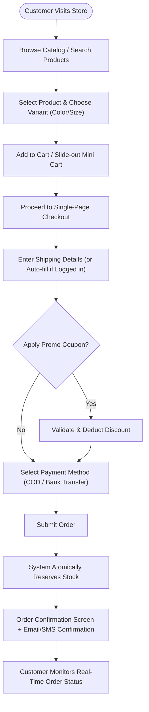
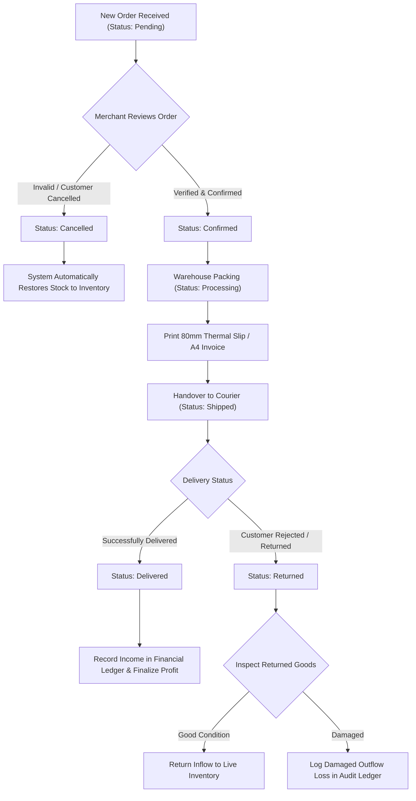
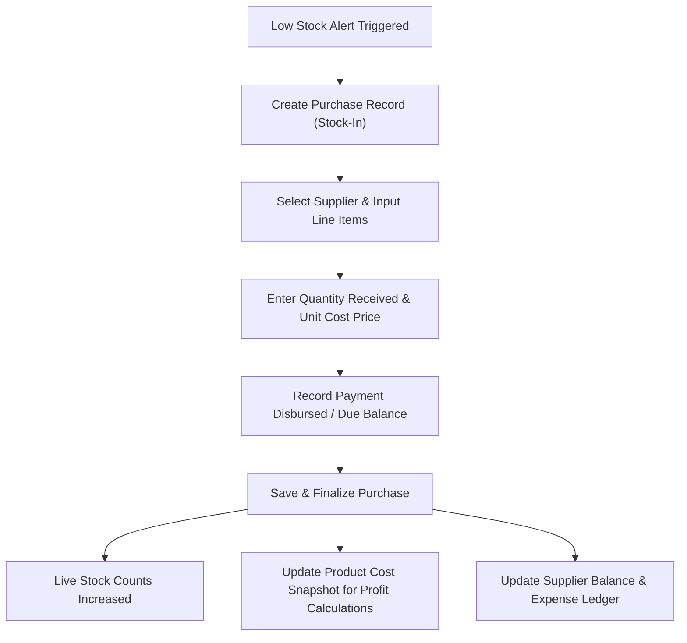
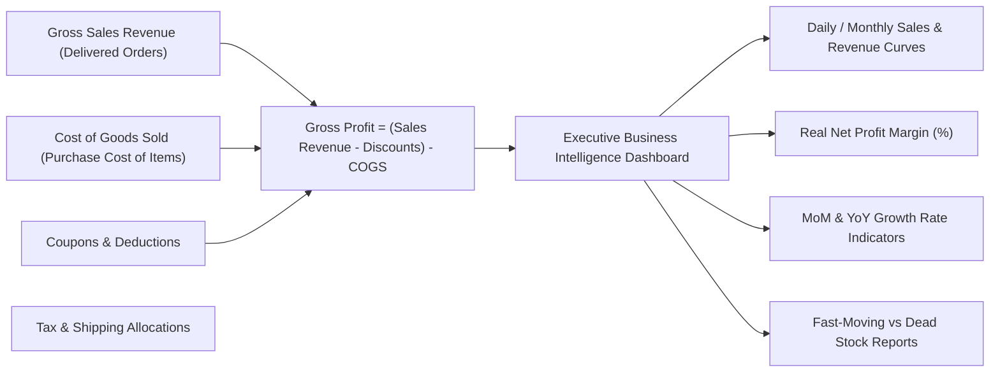
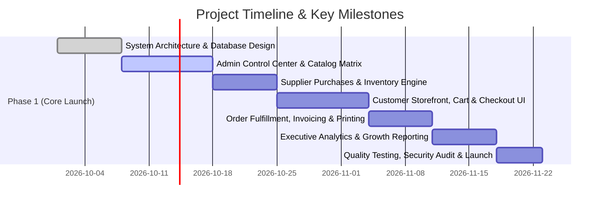

# SOFTWARE REQUIREMENTS & PROJECT SPECIFICATION (SRS)
## Client & Stakeholder Edition
**Project Name:** Enterprise Single-Vendor E-Commerce Platform  
**Target Platform:** Web (Ultra-Responsive for Mobile, Tablet & Desktop)  
**Technology Stack:** Laravel, React.js, Tailwind CSS, MySQL  
**Prepared & Architected By:** Jahidul Islam ([jahidcse181@gmail.com](mailto:jahidcse181@gmail.com))  
**Prepared For:** Business Stakeholders & Management  

---

## 1. EXECUTIVE SUMMARY & BUSINESS VALUE

This Software Requirements Specification outlines the blueprint for a **high-performance, modern Single-Vendor E-Commerce platform**. The platform is designed from the ground up to solve the three biggest challenges online merchants face:

1. **Slow Website Speeds & Lost Sales:** By combining modern React frontend technology with Laravel's high-speed backend, pages load instantly, ensuring customers do not bounce.
2. **Inventory & Financial Blindspots:** Complete tracking of product costs, supplier purchases, stock adjustments, and real profit margins—eliminating guesswork in business profitability.
3. **Manual Order Chaos:** A centralized control hub with 1-click status updates, instant professional PDF invoice generation, and POS thermal receipt printing for warehouse packing.

---

## 2. PHASED ROLLOUT STRATEGY

To get your business online quickly while maintaining software quality, development is divided into two distinct phases:

```mermaid
flowchart LR
    subgraph P1["PHASE 1: Core E-Commerce & Business Operations (Current Scope)"]
        direction TB
        P1A["Attractive Responsive Storefront"]
        P1B["Variant Products & Catalog"]
        P1C["Frictionless Cart & Single-Page Checkout"]
        P1D["Cash on Delivery & Manual Bank/MFS"]
        P1E["Inventory & Supplier Purchase Records"]
        P1F["A4 PDF & 80mm Thermal Receipt Printing"]
        P1G["Comprehensive Sales, Profit & Growth BI"]
        P1H["Admin Audit Trail & Role Permissions"]
    end

    subgraph P2["PHASE 2: Automation & Integrations (Future Scope)"]
        direction TB
        P2A["Automated Payment Gateways (Cards, bKash, Nagad)"]
        P2B["Courier API Automation (1-Click Waybill & Tracking)"]
        P2C["Automated SMS & WhatsApp Status Updates"]
    end

    P1 --> P2
```

---

## 3. COMPREHENSIVE FEATURE BREAKDOWN

### 3.1 Customer Storefront Experience (Converting Visitors to Buyers)

* **Ultra-Fast Responsive Design:** Fluidly adapts to iPhones, Android devices, tablets, and wide desktop screens.
* **Smart Product Discovery:**
  * Live search with instant suggestions.
  * Multi-layer filters (Filter by Category, Brand, Price Range, Color, Size, and In-Stock items).
  * Clear category hierarchies and featured product showcases.
* **Dynamic Product Detail Page:**
  * High-definition zoomable image gallery.
  * Interactive variant selection (e.g., Selecting "Black" + "XL" instantly displays the accurate price, image, and available stock).
  * Low stock alerts (e.g., *"Only 3 left in stock - order soon"*) to increase buyer urgency.
* **Frictionless Cart & Single-Page Checkout:**
  * Slide-out mini cart for instant cart updates without reloading the page.
  * Guest checkout support (no mandatory registration required to place an order).
  * Promo discount coupon validator with instant price deduction.
  * Clear order summary with breakdown of subtotal, tax/VAT, shipping fee, and savings.
* **Customer Self-Service Portal:**
  * Order history with real-time progress timeline (Pending -> Confirmed -> Shipped -> Delivered).
  * 1-Click download of official PDF invoices.
  * Saved delivery addresses for rapid future checkouts.

---

### 3.2 Merchant Admin Backoffice (Your Central Business Control Tower)

* **Executive Dashboard & Real-Time Overview:**
  * Today's revenue, order count, and gross profit at a glance.
  * Critical action cards: Pending orders waiting for confirmation, out-of-stock and low-stock alerts.
  * Visual sales velocity charts (Daily, Weekly, Monthly, and Annual).
* **Catalog & Variant Matrix Management:**
  * Easily create simple items or complex multi-variant products (e.g. 5 Colors $\times$ 4 Sizes = 20 unique SKUs generated automatically).
  * Product-level purchase cost vs. selling price configuration.
  * Multi-image drag-and-drop upload.
* **Inventory & Supplier Purchase Ledger (Stock-In System):**
  * **Supplier Profiles:** Maintain supplier directory, contact information, purchase history, and outstanding balance payable.
  * **Purchase Orders (Stock In):** Record new supplier shipments, unit costs, shipping expenses, and amount paid. Automatically updates inventory quantities and adjusts current product cost.
  * **Stock Movement Audit Log:** Every single item added, sold, returned, adjusted, or damaged is permanently logged with who did it, why, and when.
  * **Low-Stock Notification Center:** Highlights products running out of stock before you lose potential sales.
* **Order Management & Fulfillment Hub:**
  * Filter orders by status (*Pending, Confirmed, Processing, Shipped, Delivered, Cancelled, Returned*).
  * Customer detail view with ordered items, delivery addresses, and customer notes.
  * Complete status history timeline with internal merchant notes (e.g., *"Customer confirmed delivery over phone call"*).
  * Automated inventory restocking if an order is cancelled or returned.
* **Invoice & Packing Slip Engine:**
  * **A4 Formal Tax Invoice (PDF):** Beautifully branded invoice featuring your company logo, VAT/tax details, itemized totals, and payment status for emailing or printing.
  * **80mm POS Thermal Receipt:** Direct 1-click printing on standard thermal receipt printers for warehouse packaging and dispatch.
* **Business Intelligence, Profit/Loss & Growth Comparisons:**
  * **True Profit & Loss Tracking:** Automatically subtracts the actual cost of goods sold (COGS) from sales revenue to show your **Real Net Profit**.
  * **Comparative Analytics:** Compare this month's revenue vs. last month (MoM) or this year vs. last year (YoY) with percentage growth indicators.
  * **Top Performing Products:** Identifies your highest revenue and most profitable items.
  * **Dead Stock / Idle Capital Analysis:** Identifies items sitting unsold in the warehouse for 60+ days and how much capital is tied up in them.
* **Security, Audit Trail & Staff Permissions:**
  * Role-based permissions (Super Admin, Manager, Inventory Staff).
  * Complete activity log tracking which staff member altered a price, updated stock, or changed an order status.

---

## 4. VISUAL FLOWCHARTS & BUSINESS PROCESSES

### 4.1 Customer Order & Checkout Journey

---

### 4.2 Order Fulfillment & Inventory Lifecycle

---

### 4.3 Supplier Restocking & Cost Tracking Flow

---

### 4.4 Business Intelligence & Profit Calculation Flow

---

## 5. QUALITY, PERFORMANCE & RELIABILITY GUARANTEE

| Quality Parameter | What We Build In | Business Benefit to You |
| :--- | :--- | :--- |
| **Speed & Performance** | No unnecessary database queries (Anti-N+1), optimized images, cached settings, React Virtual DOM. | Higher Google search rankings, zero lag, higher checkout conversion rates. |
| **Data Integrity** | Atomic database transactions. If an order fails midway, no ghost stock or broken records remain. | 100% accurate inventory and financial reports at all times. |
| **Mobile-First Experience** | Responsive UI engineered with Tailwind CSS, touch-friendly navigation, quick tap buttons. | Flawless shopping experience for the 80%+ of customers ordering from smartphones. |
| **Staff Accountability** | Immutable audit trail logging every admin action. | Prevents internal discrepancies or unexplained inventory loss. |
| **Future Proofing** | Modular driver-ready architecture. | Easy 1-click addition of Phase 2 payment gateways and courier APIs with zero disruption. |

---

## 6. PROJECT MILESTONES & IMPLEMENTATION TIMELINE

---

## 7. SUMMARY & NEXT STEPS

With this comprehensive specification:
1. **Developers** have an exact technical blueprint for the database, architecture, and performance requirements.
2. **Business Stakeholders** have full clarity on how every single feature contributes to increased sales, efficient warehouse management, and deep financial visibility.

*Ready for development kickoff.*
