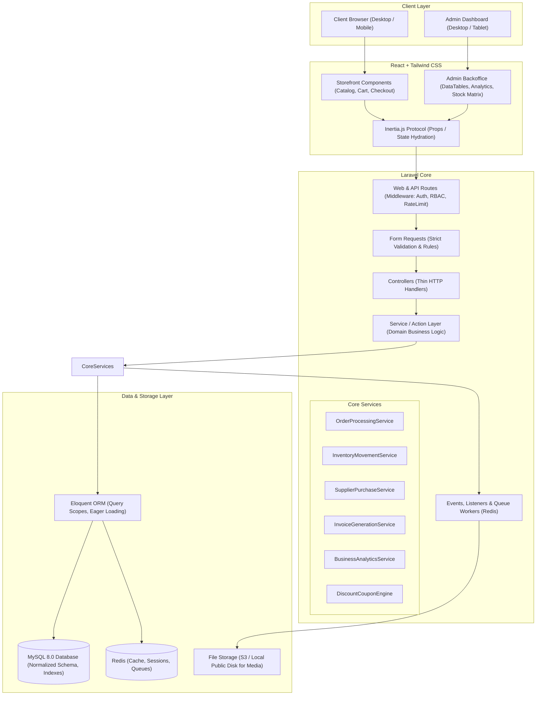
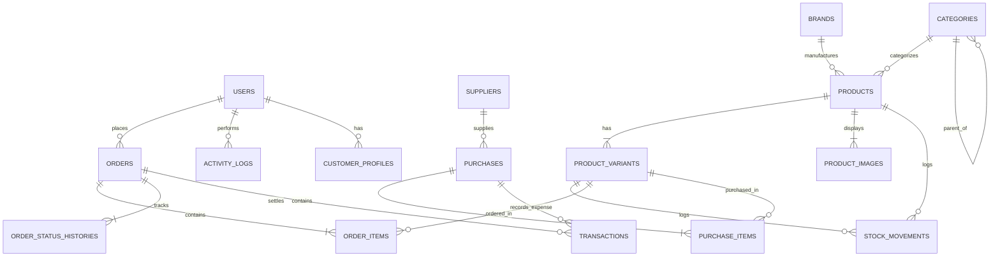
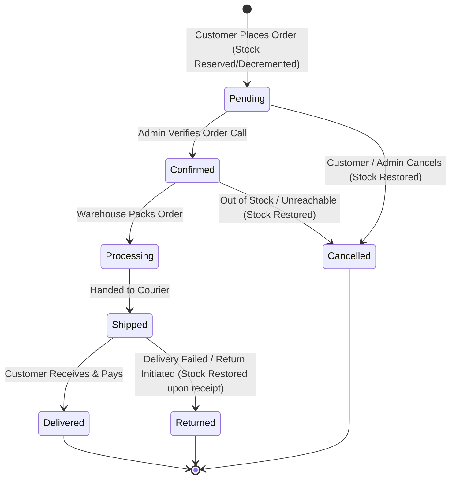
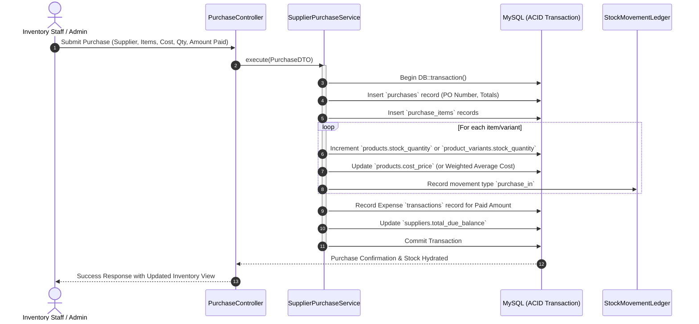
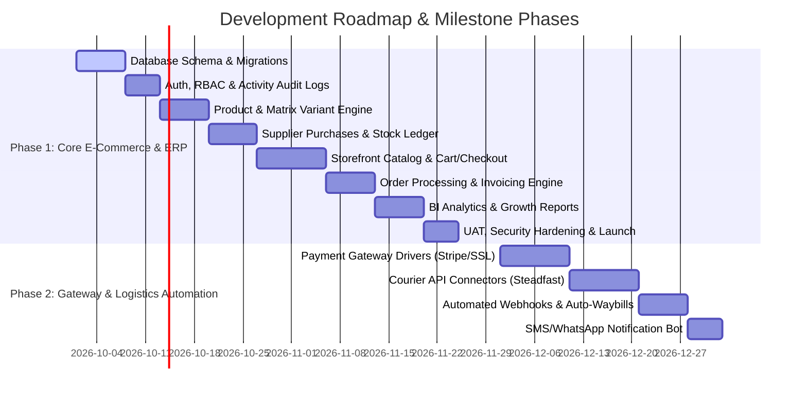

# SOFTWARE REQUIREMENTS SPECIFICATION (SRS) — DEVELOPER & TECHNICAL EDITION
## Enterprise Single-Vendor E-Commerce Platform
**Version:** 1.0.0  
**Target Architecture:** Laravel 11.x/12.x (MVC + Service/Action Domain Layer) + React 18+ (Inertia.js / SPA Components) + Tailwind CSS 3.4+ + MySQL 8.0  
**Author & Lead Architect:** Jahidul Islam ([jahidcse181@gmail.com](mailto:jahidcse181@gmail.com))  
**Status:** Approved for Implementation  

---

## 1. SYSTEM OVERVIEW & ARCHITECTURAL FOUNDATION

### 1.1 Technology Stack Matrix
| Layer | Technology | Version / Tooling | Purpose |
| :--- | :--- | :--- | :--- |
| **Backend Core** | Laravel Framework | v11.x / 12.x (PHP 8.3+) | Routing, MVC, Eloquent ORM, Auth, Queues, Scheduling |
| **Database** | MySQL | v8.0+ (InnoDB, utf8mb4) | Relational Storage, Strict Typing, Foreign Key Constraints, Indexes |
| **Caching & Queues** | Redis | v7.0+ | Session storage, Model/Query caching, Async jobs (Invoices, Notifications) |
| **Frontend Framework** | React.js | v18.x / 19.x | Component-driven UI, Reactive Storefront & Admin SPA |
| **Glue Layer** | Inertia.js | v2.x | Monolithic SPA bridge (Laravel routing + React views without REST boilerplate) |
| **Styling Engine** | Tailwind CSS | v3.4+ | JIT utility-first responsive styling, Dark/Light modes |
| **Build Tooling** | Vite | v5.x | HMR (Hot Module Replacement), Code-splitting, Asset bundling |
| **PDF Generation** | Browsershot / DomPDF | Latest stable | High-fidelity A4 and POS Thermal 80mm Invoice Generation |
| **Charts & BI** | ApexCharts / Chart.js | Latest | Interactive financial, growth, and analytics visualizations |

---

### 1.2 High-Level System Architecture Diagram



---

### 1.3 Anti-N+1 Query & High-Performance Engineering Directives

To guarantee sub-100ms response times and bulletproof database operations:

1. **Strict Lazy Loading Prohibition in Development:**
   ```php
   // app/Providers/AppServiceProvider.php
   public function boot(): void
   {
       Model::preventLazyLoading(! app()->isProduction());
       Model::preventSilentlyDiscardingAttributes(! app()->isProduction());
       Model::preventAccessingMissingAttributes(! app()->isProduction());
   }
   ```
2. **Mandatory Eager Loading Scopes:**
   - Catalog queries must explicitly specify relationships:
     `Product::with(['brand:id,name,slug', 'categories:id,name,slug', 'variants.attributeValues', 'media'])`
   - Order history queries must use:
     `Order::with(['items.product:id,name', 'items.variant', 'customer:id,name,phone', 'latestStatusHistory'])`
3. **Optimized Pagination & Resource Transformers:**
   - Always paginate large collections via `cursorPaginate()` (for infinite scroll) or standard `paginate(20)` with `through()` mapping. Never load all records with `all()`.
4. **Database Indexing Rules:**
   - Every foreign key must have an explicit B-tree index.
   - Composite indexes on query filters: `INDEX idx_product_filter (category_id, is_active, base_price)`
   - Composite index on orders: `INDEX idx_order_date_status (order_status, created_at)`
   - Full-text search index on `(name, short_description)` for products.
5. **Atomic Database Transactions:**
   - Multi-record operations (Checkout, Stock-In, Return, Order Cancellation) must be wrapped in `DB::transaction(function() { ... }, 5)` to ensure ACID compliance.

---

## 2. COMPREHENSIVE DATABASE SCHEMA (DATA DICTIONARY & ERD)



---

### 2.1 Core Tables & Field Definitions

#### 1. `users`
| Column | Type | Nullable | Default | Description / Constraints |
| :--- | :--- | :--- | :--- | :--- |
| `id` | BIGINT UNSIGNED | No | AUTO | Primary Key |
| `name` | VARCHAR(120) | No | | Full Name |
| `email` | VARCHAR(191) | No | | Unique Index |
| `phone` | VARCHAR(30) | Yes | NULL | Indexed for customer lookup |
| `password` | VARCHAR(255) | No | | Bcrypted hash |
| `role` | ENUM('super_admin','admin','manager','inventory_staff','customer') | No | 'customer' | System role |
| `is_active` | BOOLEAN | No | 1 | Account access flag |
| `remember_token` | VARCHAR(100) | Yes | NULL | |
| `created_at` / `updated_at` | TIMESTAMP | Yes | NULL | |

#### 2. `customer_profiles`
| Column | Type | Nullable | Default | Description / Constraints |
| :--- | :--- | :--- | :--- | :--- |
| `id` | BIGINT UNSIGNED | No | AUTO | Primary Key |
| `user_id` | BIGINT UNSIGNED | No | | Foreign Key -> `users.id` (CASCADE) |
| `avatar` | VARCHAR(255) | Yes | NULL | Path to image |
| `date_of_birth` | DATE | Yes | NULL | Marketing/Loyalty |
| `total_orders_count` | INT UNSIGNED | No | 0 | Denormalized counter for quick tier calculation |
| `total_spend_amount` | DECIMAL(14,2) | No | 0.00 | Lifetime Customer Value (LTV) |
| `reward_points` | INT UNSIGNED | No | 0 | Loyalty point system |
| `default_shipping_address_id`| BIGINT UNSIGNED | Yes | NULL | Foreign Key -> `addresses.id` |
| `default_billing_address_id` | BIGINT UNSIGNED | Yes | NULL | Foreign Key -> `addresses.id` |

#### 3. `addresses`
| Column | Type | Nullable | Default | Description / Constraints |
| :--- | :--- | :--- | :--- | :--- |
| `id` | BIGINT UNSIGNED | No | AUTO | Primary Key |
| `user_id` | BIGINT UNSIGNED | No | | Foreign Key -> `users.id` (CASCADE) |
| `type` | ENUM('shipping','billing') | No | 'shipping' | |
| `recipient_name`| VARCHAR(120) | No | | Delivery receiver name |
| `phone_number` | VARCHAR(30) | No | | Contact number |
| `street_address`| TEXT | No | | Road, House, Flat details |
| `city` | VARCHAR(100) | No | | City / District |
| `state_division`| VARCHAR(100) | Yes | NULL | State / Zone |
| `postal_code` | VARCHAR(20) | Yes | NULL | |
| `country` | VARCHAR(100) | No | 'Bangladesh'| ISO or country string |
| `is_default` | BOOLEAN | No | 0 | Default selection flag |

#### 4. `categories`
| Column | Type | Nullable | Default | Description / Constraints |
| :--- | :--- | :--- | :--- | :--- |
| `id` | BIGINT UNSIGNED | No | AUTO | Primary Key |
| `parent_id` | BIGINT UNSIGNED | Yes | NULL | Foreign Key -> `categories.id` (Self-referencing tree, SET NULL) |
| `name` | VARCHAR(150) | No | | Category Title |
| `slug` | VARCHAR(191) | No | | Unique Index |
| `image` | VARCHAR(255) | Yes | NULL | Category banner/thumbnail |
| `description` | TEXT | Yes | NULL | SEO Description |
| `display_order`| INT | No | 0 | Sorting sequence in menu |
| `is_active` | BOOLEAN | No | 1 | Show/Hide flag |
| `is_featured` | BOOLEAN | No | 0 | Home page highlight |

#### 5. `brands`
| Column | Type | Nullable | Default | Description / Constraints |
| :--- | :--- | :--- | :--- | :--- |
| `id` | BIGINT UNSIGNED | No | AUTO | Primary Key |
| `name` | VARCHAR(150) | No | | Brand Name |
| `slug` | VARCHAR(191) | No | | Unique Index |
| `logo` | VARCHAR(255) | Yes | NULL | Brand Logo URL |
| `is_active` | BOOLEAN | No | 1 | |

#### 6. `products`
| Column | Type | Nullable | Default | Description / Constraints |
| :--- | :--- | :--- | :--- | :--- |
| `id` | BIGINT UNSIGNED | No | AUTO | Primary Key |
| `category_id` | BIGINT UNSIGNED | No | | Foreign Key -> `categories.id` (RESTRICT) |
| `brand_id` | BIGINT UNSIGNED | Yes | NULL | Foreign Key -> `brands.id` (SET NULL) |
| `name` | VARCHAR(255) | No | | Product Title |
| `slug` | VARCHAR(255) | No | | Unique Index |
| `sku_code` | VARCHAR(100) | No | | Base SKU (Unique) |
| `barcode` | VARCHAR(100) | Yes | NULL | EAN/UPC Code (Indexed) |
| `has_variants` | BOOLEAN | No | 0 | 0 = Single Product, 1 = Configurable |
| `cost_price` | DECIMAL(12,2) | No | 0.00 | Base Purchase Cost for COGS computation |
| `selling_price`| DECIMAL(12,2) | No | 0.00 | Standard Retail Price |
| `discount_price`| DECIMAL(12,2)| Yes | NULL | Promotional Price |
| `discount_start`| DATETIME | Yes | NULL | Promo Start |
| `discount_end` | DATETIME | Yes | NULL | Promo Expiry |
| `stock_quantity`| INT | No | 0 | Sum of variant stocks or simple product stock |
| `low_stock_threshold` | INT | No | 5 | Trigger warning in admin when stock <= threshold |
| `short_description` | TEXT | Yes | NULL | For preview cards & search snippets |
| `long_description` | LONGTEXT | Yes | NULL | Rich HTML format specifications |
| `thumbnail` | VARCHAR(255) | Yes | NULL | Primary Catalog Display Image |
| `weight_kg` | DECIMAL(8,3) | Yes | NULL | Shipping calculation weight |
| `is_active` | BOOLEAN | No | 1 | Indexed |
| `is_featured` | BOOLEAN | No | 0 | Indexed |
| `views_count` | BIGINT UNSIGNED | No | 0 | Popularity counter |
| `created_at` / `updated_at` | TIMESTAMP | Yes | NULL | |

#### 7. `product_variants`
| Column | Type | Nullable | Default | Description / Constraints |
| :--- | :--- | :--- | :--- | :--- |
| `id` | BIGINT UNSIGNED | No | AUTO | Primary Key |
| `product_id` | BIGINT UNSIGNED | No | | Foreign Key -> `products.id` (CASCADE) |
| `sku` | VARCHAR(100) | No | | Unique Variant SKU (e.g. `TSHIRT-BLK-XL`) |
| `variant_name` | VARCHAR(255) | No | | Human readable (e.g. `Color: Black, Size: XL`) |
| `attributes_json` | JSON | No | | `{ "color": "Black", "size": "XL" }` |
| `cost_price` | DECIMAL(12,2) | No | 0.00 | Variant-specific acquisition cost |
| `selling_price`| DECIMAL(12,2) | No | 0.00 | Variant-specific selling price |
| `discount_price`| DECIMAL(12,2)| Yes | NULL | Variant-specific promo price |
| `stock_quantity`| INT | No | 0 | Live physical stock for this exact variant |
| `low_stock_threshold` | INT | No | 3 | Alert level |
| `image` | VARCHAR(255) | Yes | NULL | Specific image (e.g., specific color) |
| `is_active` | BOOLEAN | No | 1 | |

#### 8. `product_images`
| Column | Type | Nullable | Default | Description / Constraints |
| :--- | :--- | :--- | :--- | :--- |
| `id` | BIGINT UNSIGNED | No | AUTO | Primary Key |
| `product_id` | BIGINT UNSIGNED | No | | Foreign Key -> `products.id` (CASCADE) |
| `image_path` | VARCHAR(255) | No | | Storage URL/Path |
| `is_primary` | BOOLEAN | No | 0 | Featured image flag |
| `sort_order` | INT | No | 0 | Display sequence |

#### 9. `suppliers`
| Column | Type | Nullable | Default | Description / Constraints |
| :--- | :--- | :--- | :--- | :--- |
| `id` | BIGINT UNSIGNED | No | AUTO | Primary Key |
| `name` | VARCHAR(150) | No | | Contact Person Name |
| `company_name` | VARCHAR(150) | No | | Business / Factory Name |
| `phone` | VARCHAR(30) | No | | Contact Phone (Indexed) |
| `email` | VARCHAR(150) | Yes | NULL | |
| `address` | TEXT | Yes | NULL | Physical address |
| `total_purchased_amount` | DECIMAL(14,2) | No | 0.00 | Lifetime purchase volume |
| `total_paid_amount` | DECIMAL(14,2) | No | 0.00 | Total paid to supplier |
| `total_due_balance` | DECIMAL(14,2) | No | 0.00 | Accounts payable balance |
| `is_active` | BOOLEAN | No | 1 | |

#### 10. `purchases` (Stock-In Records)
| Column | Type | Nullable | Default | Description / Constraints |
| :--- | :--- | :--- | :--- | :--- |
| `id` | BIGINT UNSIGNED | No | AUTO | Primary Key |
| `po_number` | VARCHAR(50) | No | | Unique PO Code (e.g., `PO-202609-0012`) |
| `supplier_id` | BIGINT UNSIGNED | No | | Foreign Key -> `suppliers.id` (RESTRICT) |
| `purchase_date`| DATE | No | | Transaction Date |
| `subtotal_cost`| DECIMAL(14,2) | No | 0.00 | Sum of line items |
| `shipping_cost`| DECIMAL(10,2) | No | 0.00 | Freight/Handling costs |
| `tax_amount` | DECIMAL(10,2) | No | 0.00 | Incurred tax |
| `discount_amount`| DECIMAL(10,2)| No | 0.00 | Supplier discount |
| `grand_total` | DECIMAL(14,2) | No | 0.00 | Net total payable |
| `paid_amount` | DECIMAL(14,2) | No | 0.00 | Cash/Bank disbursed |
| `due_amount` | DECIMAL(14,2) | No | 0.00 | Remaining liability |
| `payment_status`| ENUM('paid','partial','unpaid') | No | 'unpaid' | |
| `status` | ENUM('draft','received','cancelled') | No | 'received' | Only 'received' updates stock |
| `invoice_attachment` | VARCHAR(255) | Yes | NULL | Scanned supplier voucher |
| `notes` | TEXT | Yes | NULL | Internal remarks |
| `created_by_user_id`| BIGINT UNSIGNED | No | | Foreign Key -> `users.id` |
| `created_at` / `updated_at` | TIMESTAMP | Yes | NULL | |

#### 11. `purchase_items`
| Column | Type | Nullable | Default | Description / Constraints |
| :--- | :--- | :--- | :--- | :--- |
| `id` | BIGINT UNSIGNED | No | AUTO | Primary Key |
| `purchase_id` | BIGINT UNSIGNED | No | | Foreign Key -> `purchases.id` (CASCADE) |
| `product_id` | BIGINT UNSIGNED | No | | Foreign Key -> `products.id` (RESTRICT) |
| `variant_id` | BIGINT UNSIGNED | Yes | NULL | Foreign Key -> `product_variants.id` (SET NULL)|
| `quantity` | INT UNSIGNED | No | | Units received |
| `unit_cost_price` | DECIMAL(12,2) | No | | Cost per item for this shipment |
| `subtotal` | DECIMAL(14,2) | No | | `quantity * unit_cost_price` |

#### 12. `stock_movements` (Complete Audit Ledger)
| Column | Type | Nullable | Default | Description / Constraints |
| :--- | :--- | :--- | :--- | :--- |
| `id` | BIGINT UNSIGNED | No | AUTO | Primary Key |
| `product_id` | BIGINT UNSIGNED | No | | Foreign Key -> `products.id` |
| `variant_id` | BIGINT UNSIGNED | Yes | NULL | Foreign Key -> `product_variants.id` |
| `movement_type`| ENUM('purchase_in','sale_out','order_cancel_in','return_in','manual_adjustment_in','manual_adjustment_out','damage_out') | No | | Strict classification |
| `quantity` | INT | No | | Positive (Inflow) or Negative (Outflow) |
| `unit_cost` | DECIMAL(12,2) | No | 0.00 | Snapshot unit cost at time of movement |
| `reference_type`| VARCHAR(100) | Yes | NULL | Polymorphic (e.g. `App\Models\Order`, `Purchase`) |
| `reference_id` | BIGINT UNSIGNED | Yes | NULL | ID of reference record |
| `previous_stock`| INT | No | | Stock level immediately before operation |
| `current_stock` | INT | No | | Stock level immediately after operation |
| `user_id` | BIGINT UNSIGNED | Yes | NULL | Admin/Staff who performed action |
| `notes` | VARCHAR(255) | Yes | NULL | Reason for manual adjust/damage |
| `created_at` | TIMESTAMP | No | CURRENT | Timestamp of occurrence |

#### 13. `orders`
| Column | Type | Nullable | Default | Description / Constraints |
| :--- | :--- | :--- | :--- | :--- |
| `id` | BIGINT UNSIGNED | No | AUTO | Primary Key |
| `order_number` | VARCHAR(40) | No | | Unique Public Order Identifier (e.g., `ORD-20260926-8821`) |
| `user_id` | BIGINT UNSIGNED | Yes | NULL | Foreign Key -> `users.id` (NULL for Guest Checkout) |
| `customer_name`| VARCHAR(120) | No | | Snapshot name |
| `customer_phone`| VARCHAR(30) | No | | Snapshot phone |
| `customer_email`| VARCHAR(150) | Yes | NULL | Snapshot email |
| `shipping_address_json` | JSON | No | | Immutable snapshot of delivery address |
| `billing_address_json` | JSON | Yes | NULL | Immutable snapshot of billing address |
| `subtotal` | DECIMAL(12,2) | No | | Sum of order items |
| `tax_amount` | DECIMAL(10,2) | No | 0.00 | Applied VAT/Tax |
| `shipping_cost`| DECIMAL(10,2) | No | 0.00 | Delivery charge |
| `discount_amount`| DECIMAL(10,2)| No | 0.00 | Total discount applied |
| `coupon_code` | VARCHAR(50) | Yes | NULL | Applied promo coupon |
| `grand_total` | DECIMAL(12,2) | No | | `subtotal + tax + shipping - discount` |
| `total_cost_price` | DECIMAL(12,2) | No | 0.00 | Sum of COGS for all items in order (for instant profit calculation) |
| `gross_profit` | DECIMAL(12,2) | No | 0.00 | `(subtotal - discount) - total_cost_price` |
| `payment_method`| ENUM('cod','bank_transfer','bkash_manual','stripe_online','sslcommerz_online') | No | 'cod' | |
| `payment_status`| ENUM('pending','paid','partially_refunded','refunded','failed') | No | 'pending' | |
| `order_status` | ENUM('pending','confirmed','processing','shipped','delivered','cancelled','returned') | No | 'pending' | Indexed |
| `courier_name` | VARCHAR(100) | Yes | NULL | Phase 1 manual / Phase 2 automated |
| `courier_tracking_id` | VARCHAR(100) | Yes | NULL | Tracking code |
| `customer_notes`| TEXT | Yes | NULL | Special instructions from customer |
| `admin_notes` | TEXT | Yes | NULL | Internal admin remarks |
| `delivered_at` | DATETIME | Yes | NULL | Timestamp of fulfillment |
| `created_at` / `updated_at` | TIMESTAMP | Yes | NULL | Composite index `(order_status, created_at)` |

#### 14. `order_items`
| Column | Type | Nullable | Default | Description / Constraints |
| :--- | :--- | :--- | :--- | :--- |
| `id` | BIGINT UNSIGNED | No | AUTO | Primary Key |
| `order_id` | BIGINT UNSIGNED | No | | Foreign Key -> `orders.id` (CASCADE) |
| `product_id` | BIGINT UNSIGNED | No | | Foreign Key -> `products.id` (RESTRICT) |
| `variant_id` | BIGINT UNSIGNED | Yes | NULL | Foreign Key -> `product_variants.id` (SET NULL) |
| `product_name` | VARCHAR(255) | No | | Snapshot item name at purchase |
| `variant_name` | VARCHAR(255) | Yes | NULL | Snapshot variant label |
| `sku` | VARCHAR(100) | No | | Snapshot SKU |
| `unit_cost_price`| DECIMAL(12,2)| No | 0.00 | Snapshot product unit cost (COGS) |
| `unit_selling_price`| DECIMAL(12,2)| No | | Unit retail price charged |
| `quantity` | INT UNSIGNED | No | | Item count |
| `subtotal` | DECIMAL(12,2) | No | | `quantity * unit_selling_price` |
| `total_cost` | DECIMAL(12,2) | No | 0.00 | `quantity * unit_cost_price` |

#### 15. `order_status_histories`
| Column | Type | Nullable | Default | Description / Constraints |
| :--- | :--- | :--- | :--- | :--- |
| `id` | BIGINT UNSIGNED | No | AUTO | Primary Key |
| `order_id` | BIGINT UNSIGNED | No | | Foreign Key -> `orders.id` (CASCADE) |
| `from_status` | VARCHAR(50) | Yes | NULL | Prior status |
| `to_status` | VARCHAR(50) | No | | Updated status |
| `changed_by_user_id`| BIGINT UNSIGNED | Yes | NULL | User who triggered the state change (or NULL for system) |
| `comment` | VARCHAR(255) | Yes | NULL | e.g. "Payment received via Cash on Delivery", "Dispatched with Steadfast" |
| `created_at` | TIMESTAMP | No | CURRENT | |

#### 16. `transactions` (Financial Ledger)
| Column | Type | Nullable | Default | Description / Constraints |
| :--- | :--- | :--- | :--- | :--- |
| `id` | BIGINT UNSIGNED | No | AUTO | Primary Key |
| `transaction_number`| VARCHAR(60) | No | | Unique Code (e.g. `TRX-2026-9901`) |
| `transaction_type` | ENUM('income_sale','expense_purchase','expense_refund','expense_operational') | No | | Direction of capital |
| `payable_type` | VARCHAR(100) | Yes | NULL | Polymorphic (e.g. `App\Models\Order`, `Purchase`) |
| `payable_id` | BIGINT UNSIGNED | Yes | NULL | Target ID |
| `payment_method` | VARCHAR(50) | No | | 'cash', 'bank', 'bkash', 'card' |
| `amount` | DECIMAL(14,2) | No | | Transaction value |
| `gateway_fee` | DECIMAL(10,2) | No | 0.00 | Processing fee deduction |
| `net_amount` | DECIMAL(14,2) | No | | Net settled value |
| `status` | ENUM('successful','pending','failed') | No | 'successful' | |
| `gateway_reference`| VARCHAR(150) | Yes | NULL | External Bank/MFS Transaction ID |
| `recorded_by_user_id`| BIGINT UNSIGNED | Yes | NULL | Foreign Key -> `users.id` |
| `notes` | TEXT | Yes | NULL | Transaction memo |
| `created_at` | TIMESTAMP | No | CURRENT | |

#### 17. `coupons`
| Column | Type | Nullable | Default | Description / Constraints |
| :--- | :--- | :--- | :--- | :--- |
| `id` | BIGINT UNSIGNED | No | AUTO | Primary Key |
| `code` | VARCHAR(50) | No | | Unique Promo Code (UPPERCASE) |
| `discount_type`| ENUM('percentage','fixed_amount') | No | 'percentage' | |
| `discount_value`| DECIMAL(10,2)| No | | Percentage (e.g. 15.00) or Flat Amount (e.g. 500.00) |
| `min_order_amount` | DECIMAL(10,2)| No | 0.00 | Threshold to qualify |
| `max_discount_cap` | DECIMAL(10,2)| Yes | NULL | For percentage discounts cap |
| `usage_limit_total` | INT UNSIGNED | Yes | NULL | Global max usage |
| `usage_limit_per_user`| INT UNSIGNED | No | 1 | Max times a single customer can redeem |
| `used_count` | INT UNSIGNED | No | 0 | Live counter |
| `start_date` | DATETIME | No | | Validity Start |
| `end_date` | DATETIME | No | | Validity Expiry |
| `is_active` | BOOLEAN | No | 1 | |

#### 18. `activity_logs` (System Audit Trail)
| Column | Type | Nullable | Default | Description / Constraints |
| :--- | :--- | :--- | :--- | :--- |
| `id` | BIGINT UNSIGNED | No | AUTO | Primary Key |
| `user_id` | BIGINT UNSIGNED | Yes | NULL | Actor ID |
| `action` | VARCHAR(100) | No | | e.g. `order.status_updated`, `product.price_adjusted` |
| `subject_type` | VARCHAR(100) | Yes | NULL | Polymorphic model |
| `subject_id` | BIGINT UNSIGNED | Yes | NULL | Target model ID |
| `old_payload` | JSON | Yes | NULL | Previous state snapshot |
| `new_payload` | JSON | Yes | NULL | Updated state snapshot |
| `ip_address` | VARCHAR(45) | Yes | NULL | Client IP |
| `user_agent` | TEXT | Yes | NULL | Device browser info |
| `created_at` | TIMESTAMP | No | CURRENT | |

#### 19. `settings`
| Column | Type | Nullable | Default | Description / Constraints |
| :--- | :--- | :--- | :--- | :--- |
| `id` | BIGINT UNSIGNED | No | AUTO | Primary Key |
| `group` | VARCHAR(50) | No | 'general' | 'general','seo','invoice','shipping','social' |
| `key` | VARCHAR(100) | No | | Unique Index |
| `value` | LONGTEXT | Yes | NULL | Configuration value (Serialized/JSON/String) |
| `is_public` | BOOLEAN | No | 0 | Available to React storefront props |

---

## 3. CORE BACKEND BUSINESS LOGIC & SERVICE ARCHITECTURE

The application avoids fat controllers by implementing the **Action / Service Layer Pattern**.

```
app/
├── Actions/
│   ├── Orders/
│   │   ├── CreateOrderAction.php
│   │   ├── UpdateOrderStatusAction.php
│   │   └── CancelOrderAction.php
│   ├── Inventory/
│   │   ├── AdjustStockAction.php
│   │   └── RecordStockMovementAction.php
│   ├── Purchases/
│   │   └── ReceivePurchaseOrderAction.php
│   └── Analytics/
│       ├── CalculateSalesMetricsAction.php
│       └── CalculateGrowthRateAction.php
├── Services/
│   ├── Cart/
│   │   └── CartSessionManager.php
│   ├── Invoicing/
│   │   ├── InvoicePdfGenerator.php
│   │   └── ThermalReceiptFormatter.php
│   └── Discounts/
│       └── CouponValidationService.php
```

### 3.1 Order State Machine Implementation
Order status updates must strictly follow valid transitions to prevent stock discrepancies:



#### State Transition Matrix Table
| Current Status | Allowed Next Statuses | Stock Action Triggered | Financial Action Triggered |
| :--- | :--- | :--- | :--- |
| `pending` | `confirmed`, `cancelled` | None (Stock decremented on placement) | None |
| `confirmed` | `processing`, `cancelled` | If `cancelled`: Inflow `order_cancel_in` | Cancel transaction if applicable |
| `processing` | `shipped`, `cancelled` | If `cancelled`: Inflow `order_cancel_in` | Cancel transaction |
| `shipped` | `delivered`, `returned` | If `returned`: Inflow `return_in` (after admin inspection) | Record refund/loss if applicable |
| `delivered` | `returned` (Within return window)| If `returned`: Inflow `return_in` | Process refund transaction |
| `cancelled` | *Terminal State* | No further modifications | - |

---

### 3.2 Automated Profit & Cost-of-Goods-Sold (COGS) Engine

When an order is created, the system calculates the profit margin in real time by snapshotting the product/variant's unit cost price at the exact moment of purchase:

$$\text{Item Profit} = (\text{Unit Selling Price} \times \text{Quantity}) - (\text{Unit Cost Price} \times \text{Quantity})$$
$$\text{Order Gross Profit} = (\text{Order Subtotal} - \text{Discount Amount}) - \sum(\text{Item Unit Cost Price} \times \text{Quantity})$$

This enables instant, zero-delay reporting on gross profit margins across days, weeks, months, or per individual SKU.

---

### 3.3 Supplier Purchase & Stock-In Workflow



---

## 4. INVOICE GENERATION & PRINT SYSTEM ARCHITECTURE

### 4.1 Dual Invoicing System Specification
1. **Full Standard A4 Invoice (PDF Download / Direct Print):**
   - Built with high-precision vector-styled HTML/Blade templates converted via PDF renderer.
   - Includes: Company Logo, Official VAT/BIN Number, Invoice Number, Issue Date, Customer Billing/Shipping Details, Itemized Table with SKU, Unit Price, Qty, Subtotal, Tax Breakdown, Shipping Fee, Coupon Discount, Grand Total in Words, Payment Mode, Terms & Conditions, Authorized Signature placeholder.
2. **POS 80mm Thermal Receipt (Direct Browser POS Print):**
   - Compact 80mm width CSS media print layout:
     ```css
     @media print {
         @page { size: 80mm auto; margin: 0; }
         body { width: 78mm; font-family: 'Courier New', monospace; font-size: 11px; }
         .no-print { display: none !important; }
     }
     ```
   - Includes store title, contact number, order barcode/QR code for courier scanning, item summary, total, and thank you note.

---

## 5. ANALYTICS, COMPARISONS & BUSINESS INTELLIGENCE (BI) ENGINE

The analytics engine provides pre-aggregated queries and caching for high-speed executive dashboards:

### 5.1 Analytics Metrics Formulas & SQL Aggregations

1. **Gross Sales vs Net Sales:**
   $$\text{Gross Sales} = \sum (\text{Order Item Subtotals})$$
   $$\text{Net Sales} = \text{Gross Sales} - \text{Discount Discounts} - \text{Returned Order Amounts}$$
2. **Average Order Value (AOV):**
   $$\text{AOV} = \frac{\text{Net Sales}}{\text{Total Completed Orders Count}}$$
3. **Period-over-Period Growth Rate (MoM / YoY):**
   $$\text{Growth Rate (\%)} = \left( \frac{\text{Current Period Value} - \text{Previous Period Value}}{\text{Previous Period Value}} \right) \times 100$$
4. **Top 10 High-Velocity Products:**
   ```sql
   SELECT oi.product_id, oi.product_name, SUM(oi.quantity) as total_sold, SUM(oi.subtotal) as total_revenue, SUM(oi.subtotal - oi.total_cost) as total_profit
   FROM order_items oi
   INNER JOIN orders o ON o.id = oi.order_id
   WHERE o.order_status = 'delivered' AND o.created_at BETWEEN :start_date AND :end_date
   GROUP BY oi.product_id, oi.product_name
   ORDER BY total_sold DESC
   LIMIT 10;
   ```
5. **Dead Stock / Aging Inventory Report:**
   ```sql
   SELECT p.id, p.name, p.sku_code, p.stock_quantity, p.cost_price, (p.stock_quantity * p.cost_price) as locked_capital, MAX(o.created_at) as last_ordered_at
   FROM products p
   LEFT JOIN order_items oi ON p.id = oi.product_id
   LEFT JOIN orders o ON oi.order_id = o.id
   WHERE p.stock_quantity > 0 AND p.is_active = 1
   GROUP BY p.id, p.name, p.sku_code, p.stock_quantity, p.cost_price
   HAVING last_ordered_at < DATE_SUB(NOW(), INTERVAL 60 DAY) OR last_ordered_at IS NULL
   ORDER BY locked_capital DESC;
   ```

---

## 6. FRONTEND ARCHITECTURE & COMPONENT SPECIFICATION

### 6.1 React Component Hierarchy

```
resources/js/
├── Components/
│   ├── Common/
│   │   ├── Button.jsx
│   │   ├── Modal.jsx
│   │   ├── DataTable.jsx          # Sortable, Filterable, Server-side paginated
│   │   ├── FormInput.jsx
│   │   ├── Badge.jsx
│   │   └── Toast.jsx
│   ├── Storefront/
│   │   ├── Header/Navbar.jsx
│   │   ├── ProductCard.jsx
│   │   ├── VariantSelector.jsx    # Real-time stock & price sync
│   │   ├── MiniCartDrawer.jsx
│   │   ├── CheckoutForm.jsx
│   │   └── TrackingTimeline.jsx
│   └── Admin/
│       ├── Sidebar.jsx
│       ├── TopNav.jsx
│       ├── StatCard.jsx           # Value, Trend Icon (+12.5%), Sparkline
│       ├── GrowthComparisonChart.jsx
│       ├── StockMatrixBuilder.jsx # Cartesian Product variant creator
│       └── PrintInvoiceModal.jsx
├── Pages/
│   ├── Store/
│   │   ├── Home.jsx
│   │   ├── Shop.jsx               # Multi-facet filters, query params sync
│   │   ├── ProductDetails.jsx
│   │   ├── Cart.jsx
│   │   ├── Checkout.jsx
│   │   └── Customer/Orders.jsx
│   └── Admin/
│       ├── Dashboard.jsx
│       ├── Products/Index.jsx, Create.jsx, Edit.jsx
│       ├── Inventory/StockList.jsx, StockAdjustment.jsx
│       ├── Purchases/Index.jsx, Create.jsx
│       ├── Orders/Index.jsx, Show.jsx
│       ├── Reports/Sales.jsx, ProfitLoss.jsx, Growth.jsx
│       └── Settings/Index.jsx
```

---

## 7. PHASE 1 VS PHASE 2 ARCHITECTURAL ROADMAP



### 7.1 Phase 1 Deliverables (Core Solid Foundation)
- Fully functional, highly-optimized Single Vendor Storefront.
- Cart & Single-Page Checkout supporting Cash on Delivery (COD) and Manual Banking/MFS verification.
- Complete Catalog, Brand, Category, Attribute, and Variant Matrix Management.
- Supplier Management, Purchase Invoicing (Stock-In), and Continuous Inventory Movement Tracking.
- Order Management with full lifecycle state machine, order edit/modification, and automated stock restoration on cancellation.
- Complete Invoicing System: A4 PDF Generator and 80mm POS Thermal Receipt direct printer.
- Executive Analytics: Real-time Sales, Revenue, Gross Profit (COGS), MoM/YoY Growth Comparison Charts, and Dead Stock tracking.
- Role-based permissions and detailed audit logging of every admin action.

### 7.2 Phase 2 Deliverables (Integration & Automation)
- **Payment Gateway Integration:** Modular driver-based architecture (Stripe, SSLCommerz, bKash, Nagad) with cryptographic webhook signature validation and auto-settlement.
- **Courier API Automation:** Real-time sync with courier APIs (e.g. Steadfast, Pathao, RedX, DHL) for 1-click booking, instant waybill barcode generation, and automated delivery status webhooks.
- **Automated Messaging:** Automated SMS and WhatsApp order confirmation and parcel dispatch notifications.

---

## 8. SECURITY, CODING STANDARDS & DEPLOYMENT

1. **Security Measures:**
   - Strict CSRF verification on all state-mutating requests.
   - Content Security Policy (CSP) and sanitization on all user-submitted rich text.
   - Rate limiting: `throttle:10,1` on checkout and authentication routes to prevent bot floods.
   - Encrypted customer data snapshots in orders to maintain historical accuracy regardless of profile modifications.
2. **Code Quality Standards:**
   - Strict PHP types (`declare(strict_types=1);`).
   - PSR-12 coding compliance enforced via Laravel Pint.
   - ESLint and Prettier for clean React & Tailwind components.
3. **Automated Testing Matrix:**
   - Feature tests covering Cart calculations, Coupon rules, Stock movements, and Order status state transitions.
   - Zero tolerance for untracked inventory changes.
